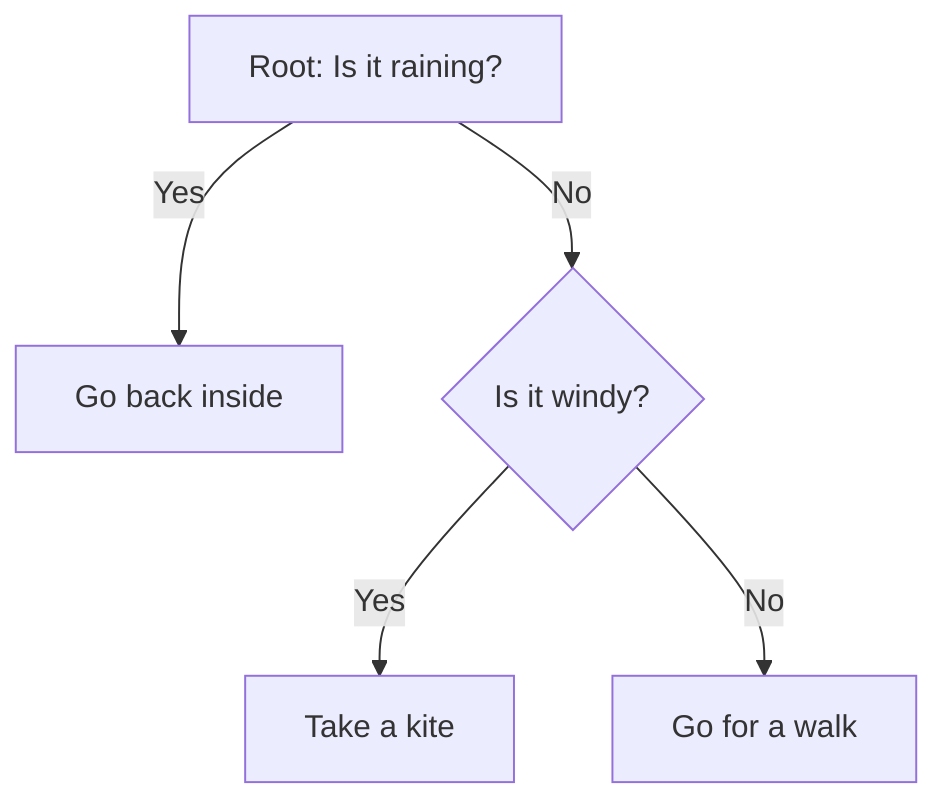

Hey there, fellow data explorer!

Today, I want to share a story from my own journey through the fascinating landscape of machine learning. It's about a technique that often feels like magic, yet is built on surprisingly intuitive principles: **Random Forests**. When I first encountered them, I was struck by their elegance and sheer power in tackling real-world problems. They're a staple in almost every data scientist's toolkit, and for good reason.

Imagine you're trying to make a really important decision, like predicting the stock market, diagnosing a disease, or even figuring out if a customer will churn. You could ask one expert for their opinion. That expert might be brilliant, but they also might have their own biases or blind spots. What if you could ask _hundreds_ of experts, each with a slightly different perspective, and then combine their wisdom? That's essentially the core idea behind Random Forests.

### The Lone Tree: Our Starting Point

To truly appreciate Random Forests, let's first understand their foundational element: the **Decision Tree**.

Think of a Decision Tree as a flowchart. You start at the "root" node, ask a question (e.g., "Is the customer's age > 30?"), and based on the answer, you go down a specific branch. You keep asking questions until you reach a "leaf" node, which gives you the final prediction or classification.

Decision trees are incredibly intuitive and easy to interpret. You can literally trace the path a decision takes. I loved them for their transparency! However, in my early days, I quickly learned they have a significant weakness: they're prone to **overfitting**. A single tree, left unchecked, can become overly complex, memorizing the training data perfectly but failing miserably on new, unseen data. It's like an expert who's brilliant at recalling specific past events but can't generalize their knowledge to new situations. They're also quite **unstable** – a tiny change in the input data can lead to a drastically different tree structure.

This is where the idea of an "ensemble" comes into play.

### The Wisdom of the Crowd: Ensemble Learning

The concept of "ensemble learning" is simple but profound: combine the predictions of multiple individual models to achieve better performance than any single model could on its own. It's the machine learning equivalent of "two heads are better than one," or even "a hundred heads are better than one!"

One common ensemble technique is **Bagging** (Bootstrap Aggregating). Here's how it works:

1.  We take our original dataset.
2.  We create multiple new datasets by **bootstrapping**. This means sampling our original data _with replacement_. So, each new dataset might have some original data points repeated, and some left out. This introduces variation.
3.  We train a separate model (e.g., a Decision Tree) on each of these bootstrapped datasets.
4.  Finally, we aggregate their predictions: for classification, we take a majority vote; for regression, we average their outputs.

Bagging helps reduce **variance** (how much the model's performance changes with different training data) and generally leads to more stable and accurate predictions. However, there's still a catch. If all the individual models in our bag are very similar, even if they're trained on different bootstrapped samples, their combined wisdom might not be as diverse as we'd hope. Imagine if all our experts had the same core bias – their combined vote might still be flawed.

This brings us to the true innovation of Random Forests.

### Entering the Forest: How Random Forests Grow

Random Forests take the concept of Bagging and add a crucial twist that makes them incredibly powerful: **randomness at the feature level**. This brilliant addition ensures that the individual trees are not only diverse due to different data samples but also due to different perspectives on the features.

Here’s my step-by-step mental image of how a Random Forest is built:

1.  **Planting Many Seeds (Bootstrapping Data):** Just like Bagging, we start by creating many bootstrapped subsets of our original training data. Each tree in our forest will be grown on one of these unique subsets. This introduces diversity in the _data samples_ each tree sees.

2.  **Selective Vision for Each Split (Feature Subsetting):** This is the game-changer! When each individual tree is being built, and it's trying to decide the _best feature to split on_ at any given node, it doesn't consider _all_ the available features. Instead, it randomly selects a _subset_ of features. For example, if you have 100 features, a tree might only consider 10 of them for a particular split.
    - **Why is this so important?** Imagine you have one overwhelmingly strong feature (e.g., "credit score" for loan approval). If every tree were allowed to consider all features, almost every tree would likely pick "credit score" as its top split. This would make all the trees very similar (correlated), defeating the purpose of combining diverse opinions. By forcing each tree to consider only a random subset of features, we encourage it to explore other, potentially less obvious, relationships in the data. This **decorrelates** the trees significantly.

3.  **Growing Deep, Independent Trees:** Each tree is typically grown to its maximum depth without pruning (or with very minimal pruning). Because of the randomness introduced at both the data and feature levels, these "overfitted" individual trees become part of a larger, robust system.

4.  **Collective Prediction (Voting/Averaging):** Once all the trees in the forest are grown, when a new data point comes in for prediction:
    - For **classification**: Each tree makes its own class prediction, and the forest aggregates these predictions by taking a **majority vote**. The class that gets the most votes wins!
    - For **regression**: Each tree predicts a numerical value, and the forest takes the **average** of these predictions.

### The Magic Behind the Forest's Wisdom

So, why does this two-pronged approach to randomness work so incredibly well?

- **Reduced Overfitting:** By averaging many deep, slightly overfitted trees, the Random Forest cancels out their individual errors and biases. The "wisdom of the crowd" prevails; the collective generalization power is far superior to any single tree.
- **Lower Variance:** The bootstrapping and averaging significantly reduce the model's variance. While individual trees might be sensitive to small changes in the data, the ensemble's overall prediction remains stable.
- **Handles High Dimensionality:** Random Forests can effectively work with datasets that have a very large number of features, thanks to the feature subsetting at each split.
- **Robustness to Noise:** Because each tree sees a different sample of data and features, the model becomes more resilient to noisy data or outliers.
- **Implicit Feature Importance:** A fantastic side benefit of Random Forests is their ability to tell you which features were most influential in making decisions across the entire forest. Features that consistently lead to better splits (reducing impurity) across many trees are deemed more important.

### A Peek Under the Hood: Mathematical Intuition

While Random Forests might seem like a complex black box, the core ideas for splitting within each tree are rooted in simple information theory. For classification, trees typically use metrics like **Gini Impurity** or **Entropy** to decide the best split.

- **Gini Impurity** measures how "pure" a node is. A Gini of 0 means all samples in that node belong to the same class (perfectly pure).
  $G = 1 - \sum_{i=1}^{C} p_i^2$
  where $C$ is the number of classes, and $p_i$ is the proportion of samples belonging to class $i$ in the node. The goal is to find a split that maximizes the _reduction_ in Gini impurity.

- **Entropy** is another measure of disorder or uncertainty. A node with high entropy is very mixed.
  $H = - \sum_{i=1}^{C} p_i \log_2(p_i)$
  The goal here is to maximize **Information Gain**, which is the reduction in entropy after a split.

For regression tasks, trees often aim to minimize the **Mean Squared Error (MSE)** or similar metrics, making splits that result in child nodes with samples whose target values are as close to each other as possible.

Feature importance, mentioned earlier, is often calculated by summing the decrease in Gini impurity (or MSE for regression) across all nodes where a particular feature is used for splitting, averaged over all trees in the forest. This gives us a numerical score for each feature's contribution.

### Tuning the Forest: Hyperparameters

Like any powerful tool, Random Forests have a few "dials" we can turn to optimize their performance, called **hyperparameters**:

- `n_estimators`: The number of trees in the forest. More trees generally lead to better performance but also increase computation time. There's usually a point of diminishing returns.
- `max_features`: The number of features to consider when looking for the best split. This is crucial for decorrelating the trees. Common choices are $\sqrt{p}$ for classification and $p/3$ for regression, where $p$ is the total number of features.
- `max_depth`: The maximum depth of each tree. While individual trees are often grown deep, limiting depth can sometimes reduce individual tree variance without sacrificing much ensemble performance.
- `min_samples_split` / `min_samples_leaf`: These control the minimum number of samples required to split an internal node or to be at a leaf node, respectively. They help prevent individual trees from becoming _too_ specific.

### Where Do Random Forests Shine? (Applications)

Random Forests are incredibly versatile and have found their way into countless applications:

- **Healthcare**: Diagnosing diseases (e.g., predicting heart disease, cancer), analyzing medical images.
- **Finance**: Fraud detection, credit risk assessment, stock market prediction.
- **E-commerce**: Customer churn prediction, recommendation systems.
- **Image Recognition**: Classifying objects in images.
- **Bioinformatics**: Gene expression analysis.

Their robustness, accuracy, and ability to handle various data types make them a go-to choice for many real-world problems.

### The Occasional Thicket: Limitations

While powerful, Random Forests aren't without their drawbacks:

- **Interpretability**: While better than neural networks, a Random Forest isn't as transparent as a single Decision Tree. Understanding _why_ a specific prediction was made requires inspecting multiple trees.
- **Computational Cost**: Training many trees, especially with very large datasets or many features, can be computationally expensive and time-consuming.
- **Memory Usage**: Storing many trees can require significant memory.

### My Journey's Takeaway

Learning about Random Forests was a significant step in my machine learning journey. It taught me the profound lesson of leveraging collective intelligence and the power of controlled randomness. They beautifully balance complexity and performance, providing a robust solution that often performs exceptionally well right out of the box.

If you're embarking on your own data science adventure, understanding and implementing Random Forests will undoubtedly equip you with a formidable tool. So, go forth, grow your own forests, and uncover the hidden wisdom within your data!

Keep exploring, keep learning. The data wilderness awaits!
