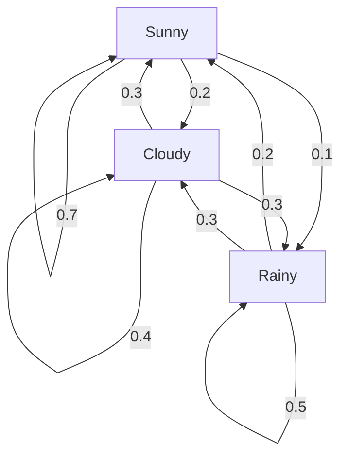

Hey everyone!

As a data science enthusiast, there are certain foundational concepts that, once you grasp them, suddenly make a lot of complex systems seem brilliantly simple. For me, one of those "aha!" moments came with understanding **Markov Chains**. It's a concept so elegant, so intuitive, yet so immensely powerful that it feels like discovering a secret language the universe uses to describe change.

It started with a simple thought experiment: What will the weather be like tomorrow? If it's sunny today, is it more likely to be sunny tomorrow, or cloudy? What if it's been raining for three days straight – does that history make rain more probable for day four? This seemingly trivial question opens the door to a fundamental idea in probability and statistics: the Markov Chain.

### What is a Markov Chain? The "Memoryless" Marvel

Imagine you're trying to predict the weather. You know it's sunny today. Does knowing it was sunny yesterday, and cloudy the day before, help you predict tomorrow's weather _more_ accurately than just knowing it's sunny _today_?

For a Markov Chain, the answer is a resounding "no!"

At its core, a **Markov Chain** is a sequence of events where the probability of the _next_ event depends _only_ on the _current_ event, not on the entire sequence of events that preceded it. This is famously known as the **Markov Property**, or sometimes, the "memoryless" property.

Think of it like this: You're playing a board game. Your next move depends on where you are _right now_ (your current square) and the dice roll. It doesn't matter how many turns it took you to get to that square, or which path you took. Your past moves are irrelevant to your next move, only your current position matters.

Mathematically, we can express the Markov Property as:

$P(X_{n+1} = x | X_n = x_n, X_{n-1} = x_{n-1}, ..., X_0 = x_0) = P(X_{n+1} = x | X_n = x_n)$

Where:

- $X_n$ represents the state of the system at time step $n$.
- $x$ and $x_i$ represent specific possible states.
- $P(...)$ is the probability of an event.

This equation simply says: the probability of transitioning to state $x$ at the next time step ($n+1$), given all past states up to the current state ($n$), is the same as the probability of transitioning to state $x$ given _only_ the current state ($X_n$). Pretty neat, right?

### Building Our First Markov Chain: The Weather Model

Let's stick with our weather example to make this concrete. Suppose the weather in a particular region can only be in one of three states: **S**unny, **C**loudy, or **R**ainy.

To define our Markov Chain, we need two things:

1.  **States:** The possible conditions the system can be in. In our case: {Sunny, Cloudy, Rainy}.
2.  **Transition Probabilities:** The probabilities of moving from one state to another. These are the heart of a Markov Chain.

Let's make up some probabilities (these would usually be derived from historical data):

- If it's **Sunny** today:
  - 70% chance it's Sunny tomorrow ($P(S \to S) = 0.7$)
  - 20% chance it's Cloudy tomorrow ($P(S \to C) = 0.2$)
  - 10% chance it's Rainy tomorrow ($P(S \to R) = 0.1$)
- If it's **Cloudy** today:
  - 30% chance it's Sunny tomorrow ($P(C \to S) = 0.3$)
  - 40% chance it's Cloudy tomorrow ($P(C \to C) = 0.4$)
  - 30% chance it's Rainy tomorrow ($P(C \to R) = 0.3$)
- If it's **Rainy** today:
  - 20% chance it's Sunny tomorrow ($P(R \to S) = 0.2$)
  - 30% chance it's Cloudy tomorrow ($P(R \to C) = 0.3$)
  - 50% chance it's Rainy tomorrow ($P(R \to R) = 0.5$)

Notice that for each starting state, the probabilities of transitioning to _all_ possible next states sum up to 1 (e.g., $0.7 + 0.2 + 0.1 = 1$). This makes sense, as the weather _has_ to be one of those options tomorrow.

### The Transition Matrix: Our Crystal Ball

These probabilities can be neatly organized into a **Transition Matrix**, often denoted by $P$. Each row represents the _current_ state, and each column represents the _next_ state.

$$
P = \begin{pmatrix}
P(S \to S) & P(S \to C) & P(S \to R) \\
P(C \to S) & P(C \to C) & P(C \to R) \\
P(R \to S) & P(R \to C) & P(R \to R)
\end{pmatrix}
$$

Plugging in our values:

$$
P = \begin{pmatrix}
0.7 & 0.2 & 0.1 \\
0.3 & 0.4 & 0.3 \\
0.2 & 0.3 & 0.5
\end{pmatrix}
$$

This matrix is incredibly powerful! If we know the weather today, say it's Sunny, we can represent our current state as a row vector $\pi_0 = \begin{pmatrix} 1 & 0 & 0 \end{pmatrix}$ (100% Sunny, 0% Cloudy, 0% Rainy).

To find the probability distribution for tomorrow's weather ($\pi_1$), we simply multiply our current state vector by the transition matrix:

$\pi_1 = \pi_0 P = \begin{pmatrix} 1 & 0 & 0 \end{pmatrix} \begin{pmatrix} 0.7 & 0.2 & 0.1 \\ 0.3 & 0.4 & 0.3 \\ 0.2 & 0.3 & 0.5 \end{pmatrix} = \begin{pmatrix} 0.7 & 0.2 & 0.1 \end{pmatrix}$

This makes sense! If it's Sunny today, there's a 70% chance of Sunny, 20% of Cloudy, and 10% of Rainy tomorrow.

What about the day after tomorrow? We can find $\pi_2$ by multiplying $\pi_1$ by $P$:

$\pi_2 = \pi_1 P = (\pi_0 P) P = \pi_0 P^2$

And for $n$ days into the future, it's just $\pi_n = \pi_0 P^n$. The transition matrix allows us to peer into the future, albeit probabilistically!

### Visualizing the Flow: State Diagrams

Sometimes, it's easier to see things visually. We can represent a Markov Chain using a **state diagram**:

- Each state is a node (a circle).
- Arrows (directed edges) connect states, indicating possible transitions.
- Each arrow is labeled with its transition probability.

(Note: Markdown does not natively support Mermaid diagrams, but this illustrates how one would represent it, perhaps using an image in a real blog post.)

This diagram helps us visualize the "flow" of probability between states.

### The Long Run: Stationary Distribution (Steady State)

One of the most fascinating properties of many Markov Chains is what happens in the _long run_. If we keep multiplying our probability distribution by the transition matrix ($P^n$ for large $n$), what do you think happens?

For many Markov Chains (specifically, those that are "irreducible" and "aperiodic" – terms for ensuring every state is reachable from every other state and there are no deterministic cycles), the system eventually reaches a **stationary distribution**, also known as a **steady state**.

This means that after a very long time, the probability of being in any particular state stabilizes, _regardless of the initial state_. The system forgets its starting point entirely!

Mathematically, the stationary distribution $\pi_{steady}$ is a probability vector that satisfies:

$\pi_{steady} = \pi_{steady} P$

This means that if the system is already in its steady state distribution, applying another transition step doesn't change the distribution. The "flow" of probability into a state exactly balances the "flow" out of it.

For our weather example, if you ran the simulation for weeks or months, you'd find a stable probability distribution for Sunny, Cloudy, and Rainy days. For instance, it might converge to something like: 40% Sunny, 30% Cloudy, 30% Rainy. This would tell us the long-term proportion of each type of day, completely independent of whether it was sunny or rainy _today_. This is incredibly useful for understanding the inherent characteristics of the system!

### Where Do Markov Chains Shine? Real-World Applications!

The simplicity of Markov Chains belies their immense applicability. Here are just a few places where they pop up in the real world:

1.  **Google PageRank:** This is perhaps the most famous application! Google used a Markov Chain to rank web pages. Each web page is a state, and a hyperlink from one page to another is a transition. The probability of transitioning from page A to page B is related to the number of links on page A pointing to page B. The steady-state distribution of this massive Markov Chain gives each page a "rank" or "importance score." Pages with a higher steady-state probability are more likely to be visited by a "random surfer" and thus deemed more important.
2.  **Natural Language Processing (NLP):**
    - **Text Generation:** Simple Markov models can generate text by predicting the next word based on the current word or a sequence of words. "I like to eat" followed by "apples" or "pizza". This is how early predictive text worked!
    - **Speech Recognition:** Markov models (specifically Hidden Markov Models, or HMMs, which are an extension) are fundamental to translating spoken words into text.
    - **Spam Filtering:** Analyzing patterns of words.
3.  **Weather Forecasting:** As we explored, predicting tomorrow's weather based on today's. More complex models are used now, but the underlying concept is often inspired by Markovian ideas.
4.  **Genetics:** Modeling DNA sequences, where the next nucleotide might depend on the current one.
5.  **Finance:** Modeling stock price movements (though financial markets are complex and often not strictly Markovian).
6.  **Reinforcement Learning:** Markov Decision Processes (MDPs), which are an extension of Markov Chains, are the backbone of many AI agents that learn to make decisions in dynamic environments (think game AI or robotics).

### Limitations

While powerful, it's important to remember the "memoryless" property. Not all real-world phenomena strictly adhere to it. For instance, the stock market's behavior tomorrow might not _just_ depend on today's closing price, but also on the trend of the past week, or global economic news. In such cases, more complex models that incorporate more history (like Hidden Markov Models or Recurrent Neural Networks) might be necessary.

### My Takeaway & Your Turn!

Learning about Markov Chains was a pivotal moment in my data science journey. It showed me how complex, seemingly unpredictable systems can be modeled with a simple probabilistic framework. It's a testament to the power of breaking down problems into their core components and understanding the probabilities that govern their transitions.

If you're just starting out in data science or curious about how things work under the hood, I highly encourage you to dive deeper into Markov Chains. Try to:

- **Implement a simple weather model** in Python.
- **Explore how PageRank works** in more detail.
- **Think about systems around you** and whether they might be modeled as a Markov Chain.

The world is full of these elegant, memoryless processes just waiting to be understood!

Happy exploring!
