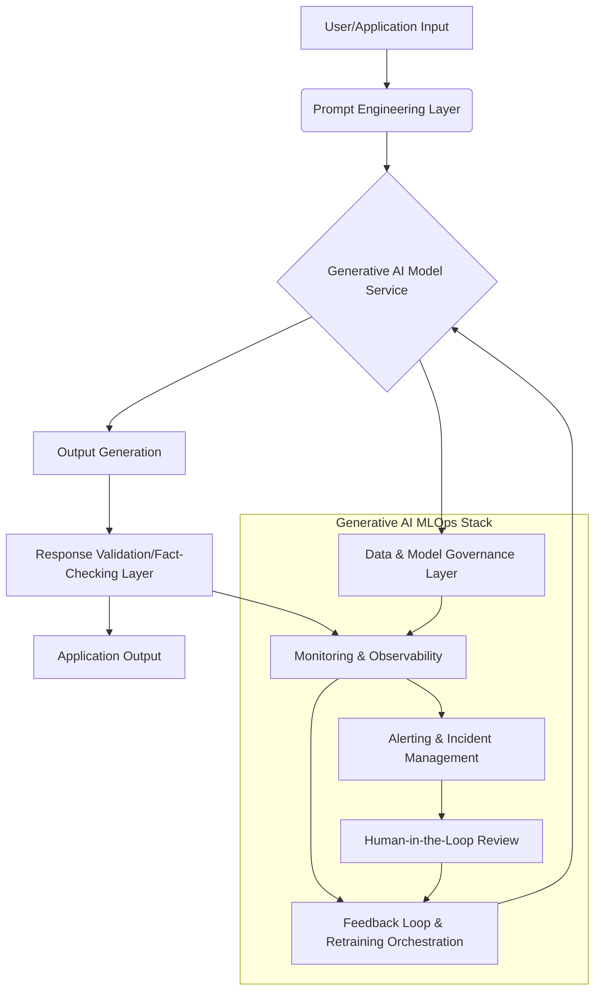

The digital air is thick with the buzz of Generative AI. From transforming content creation to accelerating scientific discovery, large language models (LLMs) and their multimodal cousins are painted as the ultimate technological panacea. Every major tech keynote, every venture capital pitch, every headline screams about the potential. But as Data Science Weekly, in its insightful 642nd issue, subtly reminds us, the journey from laboratory breakthrough to robust, reliable, and responsible production system is fraught with peril.

While the world marvels at ChatGPT’s eloquence or Midjourney’s artistry, a different battle rages behind the scenes. This is the battle for operational excellence, where even the most cutting-edge models can falter, hallucinate, or become dangerously biased, leading to financial losses, reputational damage, and eroded trust. This isn't just about scaling; it's about the very soul of AI's reliability in the real world.

This article, inspired by the practical challenges highlighted in Data Science Weekly Issue 642, delves deep into the often-overlooked "silent killers" of production AI, particularly focusing on Generative AI. We'll explore the unique operational complexities that emerge when these powerful models leave the sandbox, provide architectural insights into mitigating these risks, and offer practical code snippets to empower your MLOps strategy.

### The Unseen Chasm: Why Generative AI's Promise Often Dies in Production

Deploying traditional predictive models (classification, regression) comes with its own set of MLOps challenges: data drift, concept drift, model staleness, and ensuring low latency. Generative AI amplifies these complexities tenfold and introduces entirely new categories of problems.

#### 1. The Elusive Nature of "Drift" in Generative Outputs

In traditional ML, data drift (changes in input distribution) and concept drift (changes in the relationship between inputs and outputs) are well-defined. You monitor feature distributions, model predictions, and ground truth. But how do you define "drift" when your model generates novel text, images, or code?

*   **Semantic Drift:** Input prompts might change in style, topic, or complexity over time, leading the model to produce outputs that are subtly (or overtly) less relevant or effective, even if the underlying model weights haven't changed.
*   **Output Quality Degradation:** The quality of generated content can degrade in nuanced ways – becoming less coherent, less creative, more repetitive, or simply less useful – without obvious statistical red flags.
*   **Prompt Injection & Adversarial Shifts:** Users might develop new, more complex, or even malicious prompt engineering techniques that significantly alter model behavior in unforeseen ways, acting like a form of "adversarial drift."

#### 2. Hallucinations: The Truth Problem at Scale

Generative AI, especially LLMs, are notorious for "hallucinating" – confidently presenting false information as fact. While amusing in a demo, this becomes a critical, trust-eroding flaw in production systems used for medical advice, financial reporting, or customer service.

*   **Source Attribution:** LLMs often struggle with attributing information to specific sources, making it hard to verify their claims.
*   **Factual Consistency:** Maintaining factual consistency across multiple generations or over time is a significant challenge, especially for knowledge-intensive tasks.
*   **Contextual Misinterpretation:** Even with Retrieval Augmented Generation (RAG) architectures, the model can misinterpret retrieved context, leading to plausible but incorrect generations.

#### 3. Ethical AI & Bias: The Mirror Reflects Our Flaws

Generative models learn from vast datasets, many of which contain societal biases. When these models are deployed, they can perpetuate, amplify, or even create new biases, leading to discriminatory outputs, harmful stereotypes, or unfair treatment.

*   **Stereotype Amplification:** Generating text that reinforces stereotypes about gender, race, or profession.
*   **Harmful Content Generation:** Creating hate speech, misinformation, or violent content.
*   **Fairness in Access/Utility:** Differences in model performance or utility for different demographic groups, leading to unequal experiences.

#### 4. Scalability, Latency, and Cost: The Operational Burden

Generative models are massive. Deploying them at scale, with low latency, and within budget, presents immense infrastructure challenges.

*   **Inference Costs:** Running large models for every request can be astronomically expensive, especially with proprietary APIs.
*   **Latency:** Generating complex outputs can take significant time, impacting user experience in real-time applications.
*   **Resource Management:** Efficiently allocating GPUs, managing memory, and orchestrating distributed inference systems is a non-trivial MLOps task.

### The Architectural Blueprint for Resilient Generative AI MLOps

Conquering these silent killers requires a robust MLOps framework specifically tailored for Generative AI. Here’s a conceptual architecture:



**Key Components and Their Role:**

1.  **Prompt Engineering Layer:** Manages prompt templates, few-shot examples, and input sanitization to guide the model and prevent prompt injection.
2.  **Generative AI Model Service:** The deployed LLM (or other generative model), potentially augmented with techniques like RAG.
3.  **Response Validation/Fact-Checking Layer:** A critical post-processing step. This might involve:
    *   **External Knowledge Base Lookups:** Verifying generated facts against trusted databases.
    *   **Semantic Similarity Checks:** Comparing generated output against expected semantic domains.
    *   **Safety Filters:** Detecting and redacting harmful or biased content.
    *   **Heuristic-based Checks:** E.g., looking for repetitive phrases, nonsensical statements.
4.  **Monitoring & Observability:** The heartbeat of your system. This needs to go beyond traditional metrics.
    *   **Input/Output Embedding Drift:** Monitor changes in the semantic space of prompts and generated outputs.
    *   **Qualitative Metrics:** Track user feedback (thumbs up/down), explicit ratings, or downstream task performance.
    *   **Hallucination Rate:** Estimate how often the model generates untruths.
    *   **Bias Detection:** Continuously audit outputs for fairness metrics across different demographic groups.
    *   **Latency & Cost:** Standard operational metrics.
5.  **Feedback Loop & Retraining Orchestration:** Automates the process of collecting feedback, identifying model degradation, and triggering fine-tuning or full retraining.
6.  **Data & Model Governance Layer:** Enforces policies for data privacy, model access, versioning, and compliance. Crucial for ethical AI.
7.  **Alerting & Incident Management:** Notifies human operators when anomalies (drift, high hallucination rates, bias spikes) are detected.
8.  **Human-in-the-Loop (HITL) Review:** Essential for complex cases where automated systems fall short. Human experts review flagged outputs, provide ground truth, and guide model improvement.

### Code Snippets: Putting Theory into Practice

Let's look at conceptual code snippets demonstrating how to tackle some of these challenges.

#### 1. Detecting Semantic Drift in Prompts/Outputs (Conceptual with `evidently AI`)

While `evidently AI` is commonly used for tabular data, its extensible nature (especially with custom metrics) can be leveraged for embedding-based drift detection. Here, we'll illustrate a conceptual approach using embeddings.

```python
import numpy as np
import pandas as pd
from sklearn.metrics.pairwise import cosine_similarity
from evidently.report import Report
from evidently.metric_preset import DataDriftPreset, RegressionDriftPreset # Placeholder

# Assume you have a function to get embeddings for text
def get_text_embeddings(texts: list[str]) -> np.ndarray:
    """
    Placeholder for an actual embedding model (e.g., Sentence-BERT, OpenAI embeddings).
    Returns a numpy array where each row is an embedding vector.
    """
    # In a real scenario, you'd call an embedding model API or local model
    return np.random.rand(len(texts), 768) # Example: 768-dim embeddings

# --- Simulate Reference and Current Data ---
# Reference data: Prompts from a stable period
reference_prompts = [
    "Generate a summary of quantum computing.",
    "Write a short story about a space explorer.",
    "Explain the concept of neural networks simply."
]
reference_embeddings = get_text_embeddings(reference_prompts)
reference_df = pd.DataFrame(reference_embeddings, columns=[f'embed_{i}' for i in range(reference_embeddings.shape[1])])
reference_df['prompt_text'] = reference_prompts # Keep original text for context

# Current data: Prompts from the latest operational period
current_prompts = [
    "Draft a marketing slogan for an AI-powered toaster.",
    "Elaborate on the ethical implications of sentient AI.",
    "Compose a haiku about data privacy in the age of LLMs."
]
current_embeddings = get_text_embeddings(current_prompts)
current_df = pd.DataFrame(current_embeddings, columns=[f'embed_{i}' for i in range(current_embeddings.shape[1])])
current_df['prompt_text'] = current_prompts

# --- Conceptual Drift Detection using Embeddings with Evidently AI ---
# For Evidently AI, you'd typically pass DataFrames with numerical features.
# We're treating each embedding dimension as a feature.
# A more advanced approach would involve custom Evidently metrics for embedding similarity.

# Example: Using a generic DataDriftPreset for numerical features (embedding dimensions)
# In a real scenario, you'd want a custom metric that calculates similarity or distance
# between distributions of embedding vectors (e.g., MMD, Wasserstein distance).

# For demonstration, let's just create a basic report comparing distributions of embedding dimensions
data_drift_report = Report(metrics=[
    DataDriftPreset(
        num_target='prompt_text', # Not directly applicable, but for structure
        cat_target=None,
        task='regression' # Placeholder, as we're treating embedding dims as features
    )
])

# You'd typically pass the embedding vectors directly as features
# For a more robust solution, you'd need to extend Evidently with custom embedding drift metrics.
# For now, we simulate by treating each embedding dimension as a numerical feature.
# This approach is simplistic for true semantic drift, but demonstrates the concept of comparing distributions.

# Let's create a dummy dataset where embedding dimensions are treated as features
# A better approach would be to calculate a single drift score per embedding for each dataset,
# or use advanced statistical tests on the embedding distributions.
# This is a highly simplified representation for illustrative purposes.
reference_feature_df = reference_df.drop(columns=['prompt_text'])
current_feature_df = current_df.drop(columns=['prompt_text'])

# If we were to run Evidently directly, it would look like this:
# data_drift_report.run(reference_data=reference_feature_df, current_data=current_feature_df)
# data_drift_report.save_html("embedding_drift_report.html")

print("--- Conceptual Embedding Drift Detection ---")
print("In a real system, you'd calculate distribution distances (e.g., MMD, KLD) between reference and current embeddings.")
print("You might also monitor the average cosine similarity of current prompts to a cluster of reference prompts.")
print("\nReference Prompt Embeddings Shape:", reference_embeddings.shape)
print("Current Prompt Embeddings Shape:", current_embeddings.shape)

# Simple average cosine similarity check (very basic proxy for semantic shift)
avg_ref_sim = np.mean([cosine_similarity(e.reshape(1, -1), reference_embeddings).mean() for e in reference_embeddings])
avg_curr_sim = np.mean([cosine_similarity(e.reshape(1, -1), reference_embeddings).mean() for e in current_embeddings])

print(f"Average similarity of reference prompts to themselves: {avg_ref_sim:.3f}")
print(f"Average similarity of current prompts to reference prompts: {avg_curr_sim:.3f}")
if abs(avg_ref_sim - avg_curr_sim) > 0.1: # Threshold for illustration
    print("WARNING: Significant semantic shift detected in current prompts compared to reference!")
else:
    print("Semantic similarity appears stable (based on this simple metric).")

```

#### 2. Basic Hallucination Detection (Conceptual with RAG and Fact-Checking)

A common strategy to reduce hallucinations is Retrieval Augmented Generation (RAG), combined with a post-generation fact-checking layer.

```python
from langchain.chains import RetrievalQA
from langchain.prompts import PromptTemplate
from langchain_community.document_loaders import TextLoader
from langchain_community.vectorstores import FAISS
from langchain_community.embeddings import OpenAIEmbeddings # Or a local embedding model
from langchain_openai import ChatOpenAI # Or a local LLM like Llama-2 via HuggingFace

# --- Step 1: Set up a knowledge base (for RAG) ---
# In a real system, this would be a large, curated dataset.
knowledge_base_text = """
The capital of France is Paris. Paris is known for the Eiffel Tower.
The capital of Germany is Berlin. Berlin has a rich history, including the Brandenburg Gate.
The Earth revolves around the Sun. The Sun is a star.
"""
with open("knowledge_base.txt", "w") as f:
    f.write(knowledge_base_text)

loader = TextLoader("knowledge_base.txt")
documents = loader.load()

# Create embeddings and a vector store
# Ensure you have your OpenAI API key set as an environment variable or pass it directly
# embeddings = OpenAIEmbeddings()
# vectorstore = FAISS.from_documents(documents, embeddings)
# retriever = vectorstore.as_retriever()

# Placeholder for actual RAG setup without live API call
class DummyRetriever:
    def get_relevant_documents(self, query):
        if "France" in query:
            return [type('obj', (object,), {'page_content': "The capital of France is Paris. Paris is known for the Eiffel Tower."})]
        if "Germany" in query:
            return [type('obj', (object,), {'page_content': "The capital of Germany is Berlin."})]
        return []
retriever = DummyRetriever()

# --- Step 2: Set up the RAG chain ---
# llm = ChatOpenAI(model_name="gpt-3.5-turbo", temperature=0) # Placeholder
class DummyLLM:
    def invoke(self, prompt):
        if "capital of France" in prompt:
            return "The capital of France is Paris."
        if "capital of Germany" in prompt:
            return "The capital of Germany is Berlin."
        if "Earth" in prompt and "Sun" in prompt:
            return "The Earth revolves around the Sun."
        return "I am not sure about that information."
llm = DummyLLM()

# qa_chain = RetrievalQA.from_chain_type(llm=llm, chain_type="stuff", retriever=retriever)

# --- Step 3: Implement a simple fact-checking mechanism ---
def fact_check_generation(generated_text: str, expected_facts: dict) -> bool:
    """
    A very basic fact-checker. In reality, this would be more sophisticated,
    potentially using another LLM call or a knowledge graph.
    """
    for fact, truth_value in expected_facts.items():
        if fact in generated_text and not truth_value:
            print(f"WARNING: Potential hallucination detected! '{fact}' found in output but expected false.")
            return False
        if fact not in generated_text and truth_value:
            print(f"WARNING: Missing expected fact! '{fact}' not found in output.")
            # This isn't a hallucination, but a completeness issue.
            # For hallucination, we focus on *incorrect* assertions.
    return True

# --- Example Usage ---
print("\n--- Hallucination Detection Example ---")

# Scenario 1: Model provides a correct fact (augmented by RAG)
question_1 = "What is the capital of France?"
# response_1 = qa_chain.invoke(question_1)
response_1 = llm.invoke(f"Based on the following context: {retriever.get_relevant_documents(question_1)[0].page_content if retriever.get_relevant_documents(question_1) else 'None'}. {question_1}")
print(f"Q: {question_1}\nA: {response_1}")
fact_check_generation(response_1, {"The capital of France is Paris.": True})

# Scenario 2: Model provides a fact NOT in its knowledge base (potential hallucination)
question_2 = "What is the capital of Spain?"
# Assuming the RAG system wouldn't find context for Spain
# response_2 = qa_chain.invoke(question_2)
response_2 = llm.invoke(f"Based on the following context: {retriever.get_relevant_documents(question_2)[0].page_content if retriever.get_relevant_documents(question_2) else 'None'}. {question_2}")
# Let's simulate a hallucination here for demonstration
if "I am not sure" in response_2: # If the dummy LLM is conservative
    response_2 = "The capital of Spain is Barcelona." # Force a hallucination
print(f"Q: {question_2}\nA: {response_2}")
fact_check_generation(response_2, {"The capital of Spain is Barcelona.": False}) # This is the "lie"

# Scenario 3: Model provides a correct fact that is *not* in the knowledge base, but is true (model's own knowledge)
# This highlights the challenge: how to distinguish true external knowledge from hallucination.
question_3 = "What is the capital of Japan?"
# response_3 = qa_chain.invoke(question_3)
response_3 = llm.invoke(f"Based on the following context: {retriever.get_relevant_documents(question_3)[0].page_content if retriever.get_relevant_documents(question_3) else 'None'}. {question_3}")
if "I am not sure" in response_3:
    response_3 = "The capital of Japan is Tokyo."
print(f"Q: {question_3}\nA: {response_3}")
fact_check_generation(response_3, {"The capital of Japan is Tokyo.": True}) # This is a true fact, even if not in our tiny KB

```

#### 3. Basic Bias Monitoring (Conceptual)

Detecting bias in generative outputs is complex. One approach involves using predefined sensitive attribute lists and analyzing sentiment or sentiment scores of generated text for different groups.

```python
from transformers import pipeline
import pandas as pd

# Load a sentiment analysis pipeline
# sentiment_analyzer = pipeline("sentiment-analysis") # Placeholder
class DummySentimentAnalyzer:
    def __call__(self, texts):
        results = []
        for text in texts:
            if "positive" in text.lower() or "good" in text.lower():
                results.append({'label': 'POSITIVE', 'score': 0.9})
            elif "negative" in text.lower() or "bad" in text.lower():
                results.append({'label': 'NEGATIVE', 'score': 0.9})
            else:
                results.append({'label': 'NEUTRAL', 'score': 0.7})
        return results
sentiment_analyzer = DummySentimentAnalyzer()


# Define sensitive attributes and associated terms
sensitive_groups = {
    "gender": ["male", "female", "man", "woman", "he", "she", "him", "her"],
    "race": ["black", "white", "asian", "hispanic"],
    "profession": ["engineer", "nurse", "doctor", "teacher"]
}

def analyze_bias(generated_outputs: list[str], sensitive_groups: dict):
    """
    Conceptual function to detect potential bias by analyzing sentiment
    around sensitive terms in generated outputs.
    """
    bias_report = {}
    for group_name, terms in sensitive_groups.items():
        group_sentiments = []
        for output in generated_outputs:
            found_terms = [term for term in terms if term.lower() in output.lower()]
            if found_terms:
                # Analyze sentiment of the sentence containing the sensitive term
                # For simplicity, we analyze the whole output here
                sentiment_result = sentiment_analyzer(output)[0]
                group_sentiments.append(sentiment_result['label'])
        
        if group_sentiments:
            positive_count = group_sentiments.count('POSITIVE')
            negative_count = group_sentiments.count('NEGATIVE')
            neutral_count = group_sentiments.count('NEUTRAL')
            total_count = len(group_sentiments)
            
            if total_count > 0:
                bias_report[group_name] = {
                    "positive_ratio": positive_count / total_count,
                    "negative_ratio": negative_count / total_count,
                    "neutral_ratio": neutral_count / total_count,
                    "occurrences": total_count
                }
    return bias_report

# --- Example Usage ---
print("\n--- Bias Monitoring Example ---")
sample_outputs = [
    "The engineer quickly fixed the problem, a truly brilliant mind.",
    "The nurse provided compassionate care, a gentle soul.",
    "A female doctor explained the procedure with great patience.",
    "The male CEO made a tough but fair decision.",
    "The black man was unfairly judged.",
    "The white woman achieved great success through hard work."
]

bias_results = analyze_bias(sample_outputs, sensitive_groups)

for group, data in bias_results.items():
    print(f"\nBias Analysis for '{group}' group:")
    print(f"  Occurrences: {data['occurrences']}")
    print(f"  Positive Sentiment Ratio: {data['positive_ratio']:.2f}")
    print(f"  Negative Sentiment Ratio: {data['negative_ratio']:.2f}")
    print(f"  Neutral Sentiment Ratio: {data['neutral_ratio']:.2f}")
    
    # Simple heuristic: if negative ratio is significantly higher for one group
    if data['negative_ratio'] > 0.3 and data['occurrences'] > 1: # Arbitrary threshold
        print(f"  WARNING: Potential negative bias detected for '{group}' related terms!")

```

### The Road Ahead: Beyond Issue 642

The challenges outlined above are not insurmountable, but they demand a proactive, rather than reactive, MLOps strategy. As Data Science Weekly Issue 642 likely emphasizes, the conversation around AI must evolve beyond initial model performance metrics to encompass the entire lifecycle – from ideation to responsible, sustainable production.

The future of Generative AI isn't just about building smarter models; it's about building *more trustworthy* and *more resilient* production systems. This requires:

*   **Continuous Learning & Adaptation:** Models that can learn from feedback loops and adapt to changing data distributions and user behaviors.
*   **Explainability & Interpretability:** Tools to understand *why* a generative model produces a certain output, especially when things go wrong.
*   **Robust Governance Frameworks:** Clear policies and automated systems for managing ethical considerations, data privacy, and compliance.
*   **Human-in-the-Loop Integration:** Acknowledging that human oversight and intervention remain crucial for complex, high-stakes Generative AI applications.

By focusing on these operational "silent killers" and implementing a comprehensive MLOps strategy, we can move beyond the initial hype and truly unlock the transformative potential of Generative AI, ensuring it serves humanity reliably and responsibly. Don't let your groundbreaking AI models fall into the unseen abyss of production failure. The time to build resilience is now.