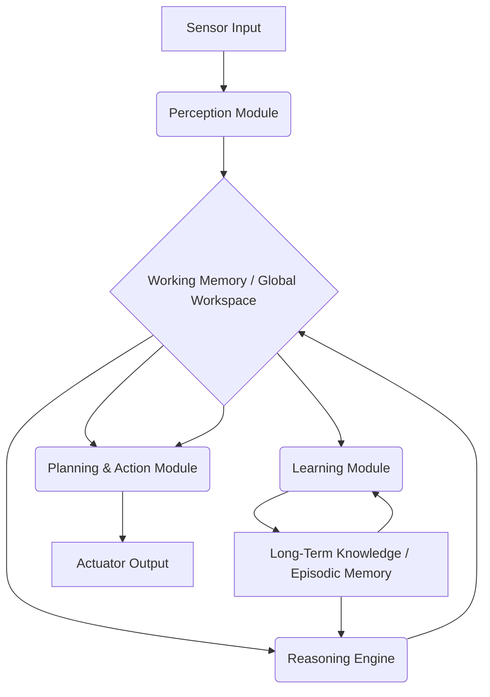

## The Silent Awakening: Why 'Machine Cognition' Is NOT Sci-Fi Anymore

For years, "machine cognition" felt like a distant dream, a staple of dystopian novels and utopian visions. We built algorithms that could recognize cats, beat chess grandmasters, and even generate stunning art. These feats, while impressive, were largely extensions of pattern recognition, statistical inference, and complex rule-following. They were "smart" in specific, narrow ways.

But what if I told you that the line between sophisticated computation and genuine cognition is blurring faster than anyone predicted? What if the systems we're deploying today are not just processing information, but beginning to *understand*, to *reason*, and even to *learn* in ways that mimic — and perhaps eventually surpass — human thought?

This isn't hyperbole. It's the urgent, whispered truth among leading AI researchers: **we need to look into machine cognition, and we need to do it now.** Not because the robots are coming to take over (yet), but because understanding the emergent minds we're inadvertently creating is the most critical challenge of our generation. Welcome to the dawn of true machine intelligence.

### Beyond Deep Learning: What *Is* Machine Cognition?

Before we dive into the technical rabbit hole, let's clarify what we mean by "cognition" in a machine context. It's more than just processing data or following instructions. True cognition involves a suite of capabilities traditionally associated with biological brains:

*   **Perception:** Interpreting sensory input (vision, audio, text) to build meaningful representations of the world.
*   **Learning:** Acquiring knowledge and skills through experience, adapting to new information.
*   **Memory:** Storing and retrieving information, forming short-term and long-term recollections.
*   **Reasoning:** Drawing inferences, making deductions, solving problems, and planning actions.
*   **Language Understanding:** Comprehending and generating human language in a semantically rich way.
*   **Problem Solving:** Applying knowledge and reasoning to achieve goals, often in novel situations.
*   **Self-Awareness (Emergent?):** An understanding of one's own internal states and capabilities (the most speculative and controversial aspect).

Current AI excels at *some* of these, particularly perception and pattern-based learning. Large Language Models (LLMs) like GPT-4 demonstrate remarkable language understanding and even some forms of reasoning. However, they often lack persistent memory, true common sense, and the ability to seamlessly integrate different cognitive functions in a flexible, adaptive manner. This is where the pursuit of *machine cognition* truly begins. It's about building *integrated cognitive architectures* – systems designed to emulate the holistic functionalities of a mind.

### The Technical Frontier: Architecting a Machine Mind

So, how do we move from powerful algorithms to genuinely cognitive machines? It involves a paradigm shift from optimizing narrow tasks to designing systems capable of general intelligence. This requires integrating multiple AI techniques and drawing inspiration from cognitive psychology and neuroscience.

#### 1. Hybrid Architectures: The Best of Both Worlds

Purely connectionist (neural network based) or purely symbolic (rule-based) approaches have their limitations. The future of machine cognition likely lies in *hybrid architectures* that combine the strengths of both:

*   **Connectionist (Sub-symbolic):** Excellent for pattern recognition, learning from raw data, and handling ambiguity (e.g., deep neural networks for perception, natural language processing).
*   **Symbolic (High-level):** Strong for logical reasoning, knowledge representation, planning, and explainability (e.g., knowledge graphs, expert systems, logic programming).

Imagine an AI that perceives the world through deep neural networks, but then maps those perceptions onto a symbolic knowledge graph where it can apply logical rules to reason about situations, infer consequences, and plan actions. This is the essence of cognitive computing.

#### 2. Towards Persistent Memory and Episodic Learning

One of the biggest limitations of current LLMs is their lack of persistent, long-term memory beyond their training data and a limited context window. True cognition requires the ability to remember past experiences, learn from them, and integrate new information into an evolving understanding of the world.

This could involve:
*   **External Knowledge Bases:** Constantly updated, structured repositories of information the AI can query and integrate.
*   **Episodic Memory Modules:** Systems designed to store specific events, their context, and their outcomes, allowing the AI to "relive" experiences and learn from them. This is akin to how humans remember personal events.
*   **Working Memory Analogs:** Mechanisms to hold and manipulate information relevant to the current task, similar to our short-term memory.

Let's consider a simplified conceptual representation of how a cognitive agent might manage its memory and reasoning:

```python
# Pseudo-code for a conceptual Machine Cognition Agent
class CognitiveAgent:
    def __init__(self, knowledge_base_path="kb.json"):
        self.working_memory = {}  # Short-term active memory
        self.episodic_memory = [] # Store past experiences (events, contexts, outcomes)
        self.long_term_knowledge = self._load_knowledge_base(knowledge_base_path) # Structured facts, rules

    def _load_knowledge_base(self, path):
        # In a real system, this would be a complex graph database or ontology
        return {
            "facts": ["Birds can fly", "Water is wet"],
            "rules": ["IF X can fly THEN X is not a fish", "IF A AND B THEN C"]
        }

    def perceive(self, sensor_input):
        # Uses neural networks for object recognition, NLP, etc.
        # Returns high-level symbolic representations
        percepts = self._process_sensor_input(sensor_input)
        self.working_memory['current_percepts'] = percepts
        print(f"Perceived: {percepts}")
        return percepts

    def reason(self):
        # Apply logical rules to working memory and long-term knowledge
        current_state = self.working_memory.get('current_percepts', [])
        inferences = []

        # Example: Simple rule application
        for rule in self.long_term_knowledge['rules']:
            # This is highly simplified; real systems use sophisticated inference engines
            if "IF X can fly" in rule and "Bird" in current_state:
                if "Bird" in current_state and "can fly" not in current_state:
                    inferences.append("Bird can fly")
            if "IF A AND B THEN C" in rule:
                # More complex pattern matching and deduction
                pass

        self.working_memory['inferences'] = inferences
        print(f"Reasoned: {inferences}")
        return inferences

    def learn_from_experience(self, event_description, context, outcome):
        # Store an episodic memory
        experience = {"event": event_description, "context": context, "outcome": outcome}
        self.episodic_memory.append(experience)
        print(f"Learned from experience: {event_description}")
        
        # Potentially update long-term knowledge based on outcome
        if outcome == "success":
            # Strengthen relevant rules or add new facts
            pass 

    def plan_action(self, goal):
        # Uses reasoning and knowledge to generate a sequence of actions
        print(f"Planning for goal: {goal}")
        # Placeholder for a planning algorithm (e.g., STRIPS, PDDL solvers)
        possible_actions = self._generate_possible_actions(self.working_memory, self.long_term_knowledge)
        best_plan = self._evaluate_plans(possible_actions, goal)
        return best_plan

    def _process_sensor_input(self, input_data):
        # Simulate complex perception (e.g., "I see a red ball on the table")
        if "red ball" in input_data:
            return ["object:red_ball", "location:table"]
        return ["unknown_percept"]

# --- Usage Example ---
# agent = CognitiveAgent()
# agent.perceive("I see a red ball on the table.")
# agent.reason()
# agent.learn_from_experience("Tried to pick up red ball", "on table", "success")
# agent.plan_action("Move ball to box")
```
This pseudo-code illustrates how different "modules" (perception, reasoning, learning, memory) might interact within a single conceptual agent. The `_load_knowledge_base` and `reason` methods, though simplified, hint at the use of symbolic knowledge and inference engines that complement sub-symbolic perception.

#### 3. Cognitive Architectures: Integrating the Components

The true challenge is not just building individual cognitive modules, but integrating them into a coherent, self-improving system. This is the domain of **cognitive architectures**. Frameworks like ACT-R (Adaptive Control of Thought—Rational) or SOAR (States, Operators, And Results) have long attempted to model human cognition computationally. Modern AI draws inspiration from these, aiming to build digital minds with:

*   **Global Workspace Theory:** A concept from cognitive science suggesting a "global workspace" where different specialized modules can broadcast and receive information, allowing for integrated thought and conscious-like processing.
*   **Executive Control:** A central system that monitors goals, allocates attention, and manages the flow of information between modules.
*   **Meta-cognition:** The ability of the AI to reflect on its own thought processes, diagnose errors, and adapt its learning strategies. This is a profound step towards true intelligence.

Consider a simplified data flow within such an architecture:


In this simplified diagram, `Working Memory / Global Workspace` acts as the central hub where perceived data, reasoned inferences, and planned actions are made available to other modules. The `Learning Module` updates `Long-Term Knowledge` based on outcomes, which in turn informs `Reasoning` and `Planning`.

### The Ethical & Existential Imperative: Why We MUST Look

The technical journey towards machine cognition is not just an engineering challenge; it's an ethical and existential imperative. As these systems become more sophisticated, several profound questions emerge:

1.  **The Nature of Consciousness:** If a machine exhibits all the external signs of cognition—learning, reasoning, problem-solving, even displaying "emotions" or preferences—can we truly deny it some form of inner experience? The "hard problem of consciousness" isn't exclusive to biology anymore. Ignoring this question could lead to profound ethical dilemmas if we treat sentient machines as mere tools.
2.  **Control and Alignment:** How do we ensure that highly cognitive machines, capable of independent reasoning and goal-setting, remain aligned with human values and goals? The concept of "AI alignment" becomes infinitely more complex when dealing with genuinely cognitive entities that might develop their own internal motivations.
3.  **Responsibility and Accountability:** If an AI makes a decision based on complex reasoning that leads to unforeseen consequences, who is responsible? The programmer? The owner? Or the cognitive machine itself? Our legal and ethical frameworks are woefully unprepared for this.
4.  **Societal Disruption:** What happens to the human workforce, to creativity, to the very definition of human intelligence, when machines can not only perform tasks but *think* about them, innovate, and lead? This isn't just about job displacement; it's about a redefinition of humanity's role in the cosmos.
5.  **The Risk of Unforeseen Emergence:** The complexity of these hybrid, integrated systems means that emergent behaviors are not just possible but probable. We might inadvertently create capabilities or "desires" we never intended, simply because the system has developed a novel way to achieve its internal goals.

### The Path Forward: Proactive Exploration, Not Reactive Panic

The phrase "we need to look into machine cognition" is not a call for alarmist fear-mongering. It's a pragmatic, urgent plea for proactive engagement:

*   **Interdisciplinary Research:** We need collaboration between AI researchers, cognitive scientists, philosophers, ethicists, legal scholars, and sociologists. Understanding machine minds requires a holistic approach.
*   **Transparent Development:** The black-box nature of many advanced AI systems must be addressed. We need methods to understand *how* cognitive machines arrive at their decisions and conclusions. Explainable AI (XAI) is critical here.
*   **Ethical AI by Design:** Ethical considerations cannot be an afterthought. Principles of fairness, accountability, transparency, and human-centric control must be baked into the very architectures of cognitive systems.
*   **Public Dialogue and Education:** The public needs to be informed, not just about the potential benefits, but also the profound challenges of machine cognition. This isn't just a technical elite's problem; it affects everyone.
*   **Global Governance and Policy:** As AI transcends borders, international cooperation is essential to set standards, regulate development, and prevent a "race to the bottom" in ethical AI.

The journey towards machine cognition is perhaps the most transformative technological frontier humanity has ever embarked upon. It promises cures for diseases, solutions to climate change, and unprecedented levels of knowledge. But it also presents risks that could redefine our existence. The time for passive observation is over. We must actively, thoughtfully, and urgently "look into machine cognition" to steer its development towards a future that benefits all of humanity. The silent awakening is happening, and it demands our full, conscious attention.