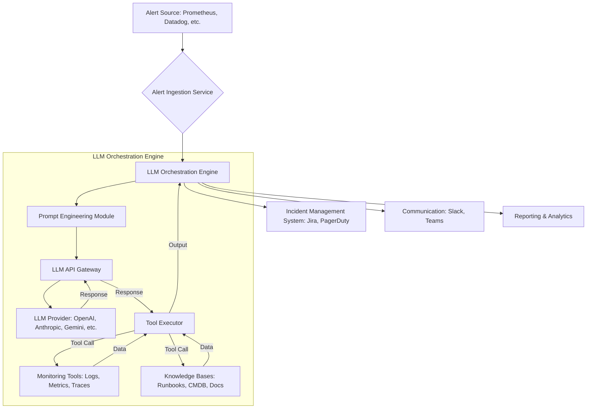

The Silent Budget Drain: Why Your AI's 'Smart' Alert Investigation Is Secretly Costing a Fortune

The promise of AI in site reliability engineering (SRE) and DevOps is intoxicating. Imagine an autonomous agent, powered by a Large Language Model (LLM), diligently sifting through mountains of logs, metrics, and traces the moment an alert fires. It correlates events, identifies root causes, suggests fixes, and maybe even self-heals, all while your human engineers are enjoying a peaceful night's sleep. This isn't science fiction; it's rapidly becoming reality.

However, beneath the shiny veneer of AI-driven efficiency lies a burgeoning challenge: cost. Specifically, the often-underestimated, rapidly escalating operational expenditure associated with LLMs constantly investigating production alerts. While the human cost of on-call burnout is undeniable, we're rapidly stumbling into a new paradigm: the *compute burnout* of our AI systems, reflected directly in our cloud bills.

This isn't just about paying for API calls; it's a complex interplay of token consumption, context window management, tool orchestration, and data retrieval that, if left unchecked, can turn your innovative AI solution into a budget black hole. In this deep dive, we'll expose the hidden cost vectors, explore the technical architecture behind LLM-powered alert investigation, provide conceptual code snippets, and arm you with actionable strategies to keep your AI smart *and* your budget lean.

## The Anatomy of an AI Alert Investigation: Where the Tokens Fly

Before we can manage costs, we need to understand how an LLM-powered agent typically investigates a production alert. It's not a single, monolithic call to an API; rather, it's an iterative, multi-step process that consumes tokens and compute resources at each stage.

1.  **Alert Ingestion & Initial Context:**
    *   An alert (e.g., from Prometheus, Datadog, Splunk) triggers the LLM agent.
    *   The agent receives the alert payload: error message, timestamps, affected services, severity, relevant tags.
    *   **Cost Factor:** Initial prompt tokens to provide the alert context to the LLM.

2.  **Information Gathering & Tool Orchestration:**
    *   The LLM, acting as the orchestrator, identifies relevant information sources. It might need to query:
        *   **Log Management Systems:** For error logs, traces related to the alert.
        *   **Monitoring Dashboards:** To check service health, resource utilization.
        *   **Runbooks/Documentation:** For known issues, troubleshooting steps.
        *   **CMDBs:** For service dependencies, ownership.
    *   It translates its reasoning into tool calls (e.g., `query_logs(service='x', timeframe='y')`, `get_dashboard_data(metric='z', host='a')`).
    *   **Cost Factor:** Multiple LLM calls for reasoning and tool selection. Each tool call's output needs to be fed back into the LLM's context. API calls to external systems (logs, metrics, etc.) also incur costs.

3.  **Iterative Analysis & Root Cause Identification:**
    *   The LLM receives the output from its tool calls.
    *   It synthesizes this new information, updates its understanding, and potentially identifies new questions to ask or new tools to use. This is often a multi-turn conversation with itself (via internal prompts).
    *   It might identify patterns, anomalies, or correlations that point towards a root cause.
    *   **Cost Factor:** More LLM calls as it refines its hypothesis. Each turn adds to the context window, increasing token usage for subsequent prompts.

4.  **Action Suggestion & Resolution:**
    *   Once a potential root cause is identified, the LLM might suggest remediation steps:
        *   Escalate to a specific team.
        *   Suggest a rollback.
        *   Recommend restarting a service.
        *   Even execute an automated remediation script (if configured and permitted).
    *   **Cost Factor:** Final LLM calls to summarize findings and generate actionable recommendations.

## The Hidden Cost Vectors: Where Your Money Really Goes

Understanding the workflow reveals several critical areas where costs accumulate:

1.  **Direct LLM API Costs (Per Token/Call):**
    *   **Input Tokens:** Every character you send to the LLM (alert data, prompts, tool descriptions, retrieved context) costs money. Longer prompts, more complex instructions, and extensive context windows mean higher input token counts.
    *   **Output Tokens:** The LLM's responses, summaries, and generated code/commands also cost. The more verbose the LLM, the higher the output token count.
    *   **Context Window Pressure:** Modern LLMs have large context windows, but filling them with logs, metric data, and documentation is expensive. If you retrieve 1000 lines of logs (tens of thousands of tokens) and pass them to the LLM for analysis, you're paying for every one of those tokens in *every subsequent turn* of the investigation within that context.

2.  **Infrastructure & Orchestration Costs:**
    *   **Agent Orchestrator:** The application layer that manages the LLM calls, tool execution, and state persistence. This could be a serverless function, a Kubernetes deployment, or a VM, all incurring compute costs.
    *   **Vector Databases (RAG):** If you're using Retrieval Augmented Generation (RAG) to provide relevant documentation or historical context, you'll have costs for vector embeddings (API calls to embedding models) and the vector database itself (storage, compute, indexing).
    *   **Data Retrieval Services:** Dedicated services or APIs to fetch logs, metrics, traces, runbooks, etc. These often have their own pricing models (e.g., data scanned, API calls).

3.  **Tooling API Costs:**
    *   Every time your LLM agent decides to `query_logs()` from Splunk, `get_metric_data()` from Datadog, or `check_jira()` for related tickets, those external API calls can incur costs, especially at scale. Many monitoring platforms charge per query or per data point retrieved.

4.  **Developer Time (Prompt Engineering & Fine-tuning):**
    *   **Prompt Engineering:** Crafting effective prompts to guide the LLM's investigation is a specialized skill. Iteration, testing, and refinement take significant developer time. Poorly engineered prompts lead to more LLM turns, higher token usage, and less effective investigations.
    *   **Fine-tuning:** If you fine-tune smaller, domain-specific models for specific alert types, the initial cost of data preparation, training, and deployment can be substantial, though it might reduce per-inference costs long-term.

5.  **Data Storage & Egress Costs:**
    *   Storing vast amounts of historical logs, metrics, and traces for LLM retrieval can be expensive.
    *   Egress costs (data transfer out of your cloud provider) can also add up if your LLM services are in a different region or cloud than your monitoring systems.

## Architectural Blueprint: An LLM-Powered Alert Investigation System

Let's visualize a typical architecture for an LLM-powered alert investigation system:



**Flow:**
1.  **Alert Source** sends an alert to the **Alert Ingestion Service**.
2.  The **Alert Ingestion Service** normalizes the alert and passes it to the **LLM Orchestration Engine**.
3.  The **Prompt Engineering Module** crafts an initial prompt, including the alert data and available tools.
4.  The prompt goes via the **LLM API Gateway** to the **LLM Provider**.
5.  The **LLM Provider** generates a response, often indicating a tool to use (e.g., "I need logs for service X").
6.  The **Tool Executor** receives this instruction, makes the actual call to **Monitoring Tools** or **Knowledge Bases**, and retrieves the data.
7.  The retrieved data is fed back into the **LLM Orchestration Engine** (typically appended to the context for the next LLM call).
8.  This iterative process continues until the LLM identifies a root cause or suggests an action.
9.  Finally, the **LLM Orchestration Engine** updates the **Incident Management System**, sends notifications via **Communication** channels, and logs findings for **Reporting & Analytics**.

Each arrow going to/from the **LLM Provider** represents a potential LLM API call, incurring token costs. Each arrow to/from **Monitoring Tools** or **Knowledge Bases** represents an external API call, incurring tooling costs.

## Conceptual Code Snippets: Bringing Costs to Life

Let's look at how token usage manifests in code.

**1. Basic LLM Call with Context:**

```python
import os
from openai import OpenAI

client = OpenAI(api_key=os.environ.get("OPENAI_API_KEY"))

def investigate_alert(alert_message: str, relevant_logs: str) -> str:
    prompt = f"""
    A production alert has fired:
    ---
    {alert_message}
    ---

    Here are some relevant logs:
    ---
    {relevant_logs}
    ---

    Analyze the alert and logs. Identify the most likely root cause and suggest a preliminary action.
    """

    # This is where the tokens get counted!
    # prompt_tokens = len(tokenizer.encode(prompt)) # if using a local tokenizer
    # The actual API call will report usage.

    response = client.chat.completions.create(
        model="gpt-4o", # Model choice impacts cost significantly
        messages=[
            {"role": "system", "content": "You are an expert SRE assistant."},
            {"role": "user", "content": prompt}
        ],
        temperature=0.7,
        max_tokens=500 # Limit output tokens to control costs
    )

    # response.usage will contain prompt_tokens and completion_tokens
    # print(f"Tokens used: Input={response.usage.prompt_tokens}, Output={response.usage.completion_tokens}")

    return response.choices[0].message.content

# Example usage (hypothetical data)
alert = "Service 'authentication-api' is returning 500 errors on /login endpoint. Error rate > 20%."
logs = """
2026-03-17 10:01:05Z [ERROR] authentication-api - Database connection pool exhausted.
2026-03-17 10:01:06Z [ERROR] authentication-api - Failed to acquire database connection.
2026-03-17 10:01:07Z [ERROR] authentication-api - Error during user login: Internal Server Error.
... (hundreds more lines of similar logs)
"""
# If 'logs' is 1000 lines, it could easily be 50,000+ tokens.
# Passing this in *every* turn of a multi-turn investigation is expensive.

# result = investigate_alert(alert, logs)
# print(result)
```

**2. Tool Use and Iterative Cost:**

Imagine a more advanced agent using tools. Each `tool_code_execution` (conceptual) and subsequent LLM call adds to the cost.

```python
# Conceptual tool definition
tools = [
    {
        "type": "function",
        "function": {
            "name": "query_logs",
            "description": "Queries logs for a given service and timeframe.",
            "parameters": {
                "type": "object",
                "properties": {
                    "service": {"type": "string", "description": "Name of the service"},
                    "timeframe": {"type": "string", "description": "e.g., 'last 5 minutes'"}
                },
                "required": ["service", "timeframe"]
            },
        },
    },
    {
        "type": "function",
        "function": {
            "name": "get_service_dependencies",
            "description": "Retrieves upstream/downstream dependencies for a service.",
            "parameters": {
                "type": "object",
                "properties": {
                    "service": {"type": "string", "description": "Name of the service"}
                },
                "required": ["service"]
            },
        },
    }
]

# Initial prompt
messages = [
    {"role": "system", "content": "You are an SRE assistant capable of using tools."},
    {"role": "user", "content": f"Production alert: Service 'authentication-api' is failing on /login."}
]

# First LLM call - LLM decides to use a tool
# response_1 = client.chat.completions.create(
#     model="gpt-4o",
#     messages=messages,
#     tools=tools
# )
# print(f"Tokens after 1st call: {response_1.usage.prompt_tokens}, {response_1.usage.completion_tokens}")
# (LLM might suggest `query_logs(service='authentication-api', timeframe='last 10 minutes')`)

# Simulate tool execution and add result to messages
# messages.append(response_1.choices[0].message) # Add LLM's tool call suggestion
# messages.append({"role": "tool", "tool_call_id": "call_abc", "content": "Database connection pool exhausted logs found."})

# Second LLM call - LLM analyzes tool output
# response_2 = client.chat.completions.create(
#     model="gpt-4o",
#     messages=messages, # Now 'messages' contains the initial prompt, LLM's tool call, and tool output.
#     tools=tools
# )
# print(f"Tokens after 2nd call: {response_2.usage.prompt_tokens}, {response_2.usage.completion_tokens}")
# (The prompt_tokens for response_2 will be significantly higher than response_1 due to accumulated context.)
```

This iterative process, common in agentic workflows, is a primary driver of escalating token costs.

## Strategies to Tame the LLM Cost Beast

The good news is that these costs are not uncontrollable. Smart design, careful implementation, and continuous monitoring can significantly mitigate the financial burden.

1.  **Optimize Prompt Engineering:**
    *   **Be Concise & Clear:** Shorter, more direct prompts reduce input tokens.
    *   **Few-Shot Learning:** Provide relevant examples in the prompt to guide the LLM, reducing the need for extensive trial-and-error (and thus, turns).
    *   **Structured Output:** Use techniques like JSON schema to force the LLM to return structured data, making parsing easier and potentially reducing output verbosity.
    *   **Summarize Before Sending:** Pre-process voluminous data (like raw logs) with a smaller, cheaper LLM or traditional NLP techniques to extract key entities and events before feeding it to the primary investigative LLM. "Send summaries, not raw data."

2.  **Intelligent Context Management (RAG Optimization):**
    *   **Retrieval Augmented Generation (RAG):** Instead of stuffing the entire knowledge base into the prompt, use a vector database to retrieve *only* the most relevant documentation or historical incidents.
    *   **Contextual Chunking:** Break down large documents into smaller, semantically coherent chunks. This ensures only the most relevant snippets are retrieved and passed to the LLM.
    *   **Dynamic Context Window:** Don't pass the *entire* conversation history in every LLM call. Summarize past turns or only include the most recent and critical parts.

3.  **Agentic Workflow Optimization:**
    *   **Early Exit Conditions:** Design your agent to exit early if a clear resolution or escalation path is identified, preventing unnecessary LLM turns.
    *   **Tool Call Minimization:** Encourage the LLM to be strategic about tool calls. Can it answer a question with current context before calling another API?
    *   **Parallel Tool Execution:** If multiple independent pieces of information are needed, execute tool calls in parallel to speed up the process and potentially reduce the number of interactive LLM turns.
    *   **Specialized Agents:** For common, well-defined alert types, consider using smaller, fine-tuned models or even rule-based systems that are much cheaper than a general-purpose LLM.

4.  **Model Selection & Tiering:**
    *   **Right Model for the Right Task:** Don't use GPT-4o for simple summarization if a smaller, cheaper model (like a fine-tuned GPT-3.5 variant or even a local open-source model) can do the job.
    *   **Tiered Approach:** Use a cheaper model for initial triage and basic summarization, escalating to a more powerful (and expensive) model only for complex investigations that require advanced reasoning or multi-step problem-solving.
    *   **Open-Source vs. Proprietary:** Explore self-hosting open-source LLMs (e.g., Llama 3, Mistral) for certain tasks, trading API costs for infrastructure and operational overhead.

5.  **Cost Monitoring & Budgeting:**
    *   **Implement FinOps for AI:** Treat LLM usage like any other cloud resource. Track token usage, API calls, and associated costs per agent, per alert type, and per service.
    *   **Set Budgets & Alerts:** Configure alerts when LLM costs approach predefined thresholds.
    *   **Analyze Usage Patterns:** Identify which alert types or investigation paths are the most expensive. This data can inform optimization efforts.

6.  **Caching & Deduplication:**
    *   **Cache LLM Responses:** For frequently occurring, identical alerts or common sub-problems, cache the LLM's investigation results.
    *   **Deduplicate Data:** Ensure you're not passing the same logs or metric data to the LLM multiple times within a short period if it hasn't changed.

## Conclusion: The Future is Smart, But Not Free

LLMs are undeniably transformative for production alert investigation, promising unprecedented speed and accuracy in incident response. However, this power comes with a significant and often hidden price tag. Treating LLM costs as an afterthought is a recipe for budget disaster.

By understanding the intricate mechanics of token consumption, carefully designing your agentic workflows, employing smart prompt engineering, and implementing robust FinOps practices, you can harness the full potential of AI for SRE without breaking the bank. The future of observability is intelligent, autonomous, and incredibly powerful – but only if we learn to manage its compute appetite responsibly. The conversation isn't just about *if* AI can investigate alerts, but *how sustainably* it can do so. Your wallet (and your engineers) will thank you.