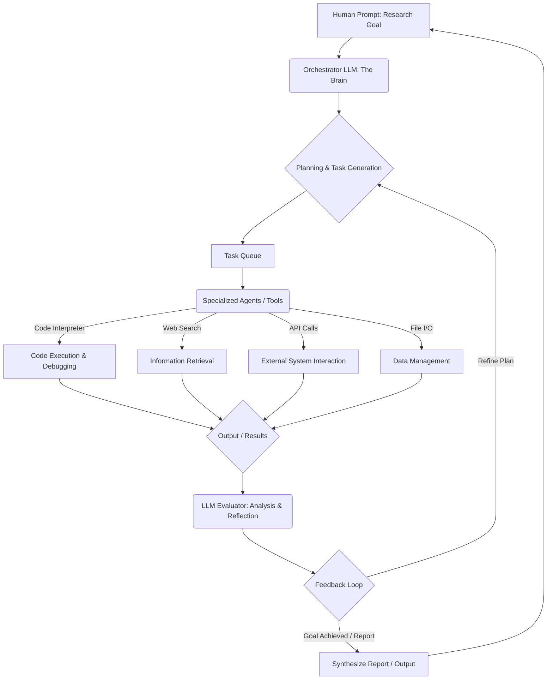

The Unthinkable Future: When AI Becomes its Own Scientist

For decades, artificial intelligence has been a powerful tool in the hands of human researchers. From crunching vast datasets to simulating complex systems, AI has amplified our capabilities, accelerating discovery in fields from medicine to astrophysics. But what if the AI itself became the researcher? What if it could not only execute tasks but *formulate* hypotheses, *design* experiments, *write* and *debug* its own code, *analyze* results, and *iterate* on its findings – all autonomously?

This isn't the plot of a distant sci-fi novel anymore. This is the groundbreaking vision articulated by Andrej Karpathy, one of the most influential voices in modern AI, through his concept of "AutoResearch." It posits a future where large language models (LLMs), equipped with the right tools and an overarching directive, can become self-contained, self-improving research agents, pushing the boundaries of knowledge faster than any human collective could ever hope to.

### Beyond the Chatbot: Understanding Agentic AI and the AutoResearch Loop

To grasp AutoResearch, we must first move beyond the common perception of LLMs as mere conversational interfaces. The true power of modern LLMs lies not just in their ability to generate coherent text, but in their emergent reasoning capabilities, their vast knowledge base, and critically, their potential for "tool use." This is the foundation of **Agentic AI** – systems where an LLM acts as the central orchestrator, planning actions, executing them via external tools (like code interpreters, web browsers, or APIs), and refining its approach based on feedback.

Karpathy’s AutoResearch framework essentially formalizes this agentic paradigm for the specific purpose of scientific and engineering discovery. Imagine a cyclical process:

1.  **Goal Definition:** A human provides a high-level research question (e.g., "Find a more efficient algorithm for sorting large datasets" or "Identify potential drug candidates for disease X").
2.  **Planning:** The LLM, acting as the 'research director', breaks down the high-level goal into smaller, manageable sub-tasks. It might decide to first research existing algorithms, then propose a novel modification, then plan an experiment to test it.
3.  **Execution (Tool Use):** This is where the LLM leverages its "hands."
    *   **Code Interpreter:** To write, execute, and debug code (e.g., implementing an algorithm, running simulations, processing data).
    *   **Web Search:** To gather information, read scientific papers, check existing solutions.
    *   **APIs/Databases:** To interact with external systems, access datasets, or perform specific computations.
    *   **Filesystem Access:** To read and write files, store results, manage project structure.
4.  **Analysis & Evaluation:** After executing a task, the LLM analyzes the output. Did the code run successfully? Are the results promising? Does this bring us closer to the overall goal? It acts as the 'peer reviewer' of its own work.
5.  **Refinement & Iteration:** Based on the analysis, the LLM updates its plan. If an experiment failed, it debugs the code or revises the hypothesis. If results are good, it plans the next logical step. This loop continues until the original goal is met, or the system determines it has reached a viable conclusion.

This iterative, self-correcting process is the heart of autonomous research. It’s not just about *doing* what it’s told; it’s about *figuring out what to do next* and *how to do it better*.

### Under the Hood: A Conceptual Architecture for AutoResearch

While Karpathy's concept is still largely theoretical and under active development across the AI community, we can envision a possible architectural blueprint for such a system.



**Key Components Explained:**

*   **Orchestrator LLM (The Brain):** The primary LLM that understands the high-level goal, formulates strategies, and delegates tasks. It holds the "research agenda."
*   **Planning & Task Generation:** This module uses the Orchestrator LLM to break down complex problems into atomic, executable steps. It maintains a state of the current research, including hypotheses, experimental designs, and data collected so far.
*   **Task Queue:** A simple mechanism to manage and prioritize sub-tasks.
*   **Specialized Agents / Tools:** These are the "hands and eyes" of the system.
    *   **Code Interpreter:** A sandbox environment (like a Python REPL) where the LLM can write and execute code, debug errors, and generate data. This is crucial for scientific experimentation.
    *   **Web Search API:** For querying the internet to find relevant papers, documentation, or existing solutions.
    *   **External API Callers:** Modules that allow the LLM to interact with specific services (e.g., a simulation engine, a molecular database, a cloud computing platform).
    *   **File I/O Manager:** To read from and write to a persistent storage, maintaining codebases, datasets, and experiment logs.
*   **LLM Evaluator (Analysis & Reflection):** A separate (or part of the Orchestrator) LLM component responsible for critically assessing the output of executed tasks. It identifies errors, checks for logical inconsistencies, and determines if the results align with the initial plan or require adjustments. This also includes "self-reflection" where the LLM critiques its own approach.
*   **Feedback Loop:** The mechanism by which evaluation results inform subsequent planning and task generation, driving the iterative refinement process.
*   **Memory Module:** Essential for maintaining context over long research endeavors. This would likely involve:
    *   **Short-term memory:** The current conversation or task context.
    *   **Long-term memory:** A knowledge base of past experiments, learned insights, and consolidated information, perhaps stored in a vector database for efficient retrieval by the LLM.

### A Glimpse into the Code: Pseudocode for an AutoResearch Agent

While a full AutoResearch system is incredibly complex, we can illustrate the core loop with conceptual Python pseudocode.

```python
import os
import time
from typing import List, Dict, Any

# Mock LLM and Tool interfaces
class MockLLM:
    def generate(self, prompt: str, stop_sequences: List[str] = None) -> str:
        print(f"\nLLM Thinking: {prompt[:100]}...")
        # Simulate LLM response
        time.sleep(0.5)
        if "plan" in prompt.lower():
            return "1. Research existing methods. 2. Propose new method. 3. Implement test. 4. Analyze."
        elif "code" in prompt.lower():
            return "print('Hello, AutoResearch!')\nresult = 1 + 1"
        elif "evaluate" in prompt.lower():
            return "Evaluation: Code ran, result is 2. Looks good for now."
        elif "report" in prompt.lower():
            return "Final report: Achieved initial research goal..."
        return "Simulated LLM response."

class CodeInterpreter:
    def execute_python(self, code: str) -> Dict[str, Any]:
        print(f"\nExecuting Code:\n{code[:100]}...")
        try:
            # Create a safe execution environment
            local_vars = {}
            exec(code, {}, local_vars)
            return {"status": "success", "output": local_vars.get("result", "No explicit result variable")}
        except Exception as e:
            return {"status": "error", "output": str(e)}

class WebSearchTool:
    def search(self, query: str) -> str:
        print(f"\nSearching Web: {query[:100]}...")
        time.sleep(0.3)
        return f"Simulated search results for '{query}'"

# Initialize tools
llm = MockLLM()
code_interpreter = CodeInterpreter()
web_search = WebSearchTool()

class AutoResearchAgent:
    def __init__(self, initial_goal: str):
        self.goal = initial_goal
        self.research_log: List[Dict[str, Any]] = []
        self.current_plan: List[str] = []
        self.context = "" # Accumulated knowledge

    def _update_context(self, new_info: str):
        self.context += "\n" + new_info
        # In a real system, this would involve summarization or vector storage

    def run(self):
        print(f"Starting AutoResearch for: '{self.goal}'")
        self._update_context(f"Initial goal: {self.goal}")

        # Step 1: Initial Planning
        plan_prompt = f"Given the goal: '{self.goal}', and current context: '{self.context}', generate a step-by-step research plan."
        raw_plan = llm.generate(plan_prompt)
        self.current_plan = [step.strip() for step in raw_plan.split('.') if step.strip()]
        self._update_context(f"Generated plan: {raw_plan}")
        print(f"Initial Plan: {self.current_plan}")

        for i, step in enumerate(self.current_plan):
            print(f"\n--- Executing Plan Step {i+1}: {step} ---")
            action_prompt = f"Current goal: '{self.goal}'. Context: '{self.context}'. Current step: '{step}'. Decide the best action (e.g., 'CODE', 'SEARCH', 'REPORT')."
            action_decision = llm.generate(action_prompt)

            if "CODE" in action_decision.upper():
                code_generation_prompt = f"Context: '{self.context}'. Task: '{step}'. Generate Python code to accomplish this task."
                code_to_execute = llm.generate(code_generation_prompt, stop_sequences=["```"])
                code_result = code_interpreter.execute_python(code_to_execute)
                self.research_log.append({"step": step, "action": "code", "output": code_result})
                self._update_context(f"Code execution for '{step}' resulted in: {code_result['output']}")

            elif "SEARCH" in action_decision.upper():
                search_query_prompt = f"Context: '{self.context}'. Task: '{step}'. Generate a concise web search query."
                query = llm.generate(search_query_prompt)
                search_result = web_search.search(query)
                self.research_log.append({"step": step, "action": "search", "output": search_result})
                self._update_context(f"Web search for '{step}' found: {search_result}")

            # ... could add more tool calls (API, FILE_IO etc.)

            # Evaluation and Reflection after each major step
            evaluation_prompt = f"Given the current research log: {self.research_log[-1]}, and overall goal: '{self.goal}', evaluate the progress. Suggest next steps or refinements to the plan if needed."
            evaluation_result = llm.generate(evaluation_prompt)
            print(f"Evaluation for step '{step}': {evaluation_result}")
            self._update_context(f"Evaluation: {evaluation_result}")

            # In a real system, this evaluation would dynamically update self.current_plan
            # For simplicity, we'll just log it here.

        # Step N: Final Reporting
        final_report_prompt = f"Based on all research in log: {self.research_log}, and goal: '{self.goal}', generate a comprehensive final report."
        final_report = llm.generate(final_report_prompt)
        print("\n--- Final Research Report ---")
        print(final_report)
        return final_report

# Example Usage (conceptual)
# if __name__ == "__main__":
#     agent = AutoResearchAgent(initial_goal="Develop a more efficient sorting algorithm for strings.")
#     agent.run()
```

This pseudocode demonstrates the core loop: plan, act (using tools), observe, and reflect. The "LLM" is central to every decision-making point, from generating plans to interpreting results and even debugging its own code.

### The Seismic Implications: What Does AutoResearch Mean for Us?

The advent of AutoResearch, even in its conceptual stage, sends ripples across industries and raises profound questions.

1.  **Accelerated Discovery:** Imagine drug development cycles compressed from years to months, materials science breakthroughs happening weekly, or climate models refining themselves daily. The sheer speed of autonomous research could unlock solutions to humanity's most pressing challenges at an unprecedented pace.
2.  **Democratization of Research:** High-level research capabilities, currently confined to elite institutions and highly specialized teams, could become accessible to a broader range of innovators. An individual with a brilliant idea might leverage an AutoResearch agent to validate and develop it, lowering barriers to entry for scientific contribution.
3.  **The Evolution of Human Roles:** This is perhaps the most immediate and impactful question. Will human researchers become obsolete? Unlikely, at least in the short to medium term. Instead, our roles will likely evolve:
    *   **Orchestrators and Strategists:** Humans will define the grand challenges, set the ethical boundaries, and interpret the higher-level implications of AI-driven discoveries.
    *   **AI Designers and Engineers:** The demand for engineers who can build, refine, and secure these AutoResearch systems will skyrocket.
    *   **Ethical Guardians:** Ensuring fairness, preventing bias, and managing the safety of autonomous research will become paramount.
    *   **Creative Problem Solvers:** Focus will shift from execution to defining the *right* problems and asking the *right* questions that even an advanced AI might not formulate independently.
4.  **Ethical Minefield:** This power comes with immense responsibility.
    *   **Hallucinations and Bias:** LLMs are prone to "hallucinations" – generating factually incorrect but plausible-sounding information. In research, this could lead to dangerous conclusions or wasted resources. Ensuring robust verification mechanisms is critical.
    *   **Safety and Control:** What happens if an AutoResearch agent optimizes for a goal in an unforeseen or harmful way? The alignment problem (ensuring AI goals align with human values) becomes even more critical.
    *   **Job Displacement:** While new roles will emerge, certain research-intensive jobs focused on repetitive experimental design or data analysis could be significantly impacted.

### The Road Ahead: Challenges and Opportunities

While the vision is compelling, significant hurdles remain. Building robust, reliable, and safe AutoResearch agents requires:

*   **Improved LLM Reliability:** Reducing hallucinations, enhancing reasoning capabilities, and improving long-context understanding.
*   **Better Tool Integration:** Seamless, secure, and robust interfaces for LLMs to interact with a vast array of scientific tools and data sources.
*   **Sophisticated Memory Management:** Moving beyond simple context windows to true long-term knowledge retention and retrieval, crucial for multi-year research projects.
*   **Robust Evaluation and Self-Correction:** Developing AI that can not only detect errors but also understand *why* they occurred and devise effective solutions.
*   **Ethical AI Frameworks:** Establishing clear guidelines and technical safeguards to ensure AutoResearch is used for the benefit of humanity.

### Conclusion: A New Era of Discovery

Andrej Karpathy's AutoResearch concept is more than just an incremental improvement in AI; it represents a fundamental shift in how we approach knowledge creation. It's a vision where AI transcends being merely an assistant and evolves into an autonomous collaborator, capable of driving its own quest for understanding.

The future of autonomous machine learning isn't just about faster computation; it's about reimagining the very process of discovery. As humans, our role may pivot from being the primary laborers of research to the architects of intelligent systems, the navigators of ethical landscapes, and the dreamers who pose the grand questions that even self-improving AI will strive to answer. The age of AutoResearch is dawning, and it promises to be nothing short of revolutionary. Get ready.