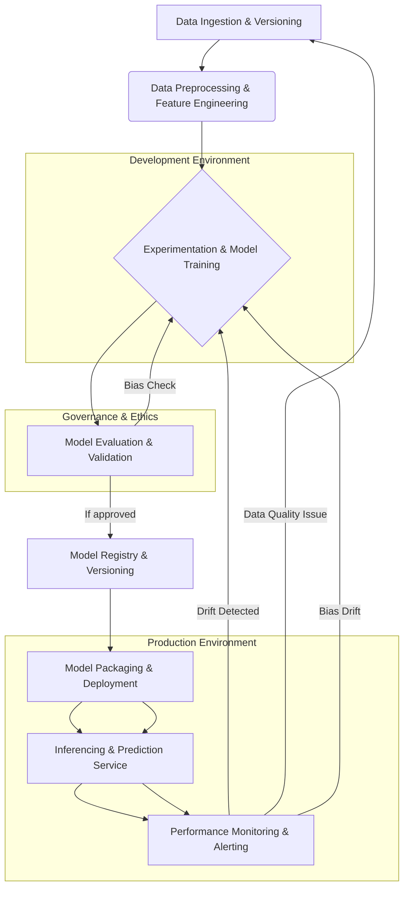

---BLOG_POST_START---
---
layout: post
title: "AI's Dirty Secret: Why We're Building Castles on Sand (And How ML Science Can Save Us)"
date: 2026-03-30 22:32:52 +0530
excerpt: "The relentless push for AI deployment is creating a chasm between true scientific rigor and fragile, hype-driven solutions. Are we sacrificing understanding for speed?"
author: "Adarsh Nair"
categories: ai
tags: ["AI", "Machine Learning", "Deployment", "MLOps", "Ethics", "Data Science", "Technical Debt"]
---
## The AI Illusion: Are We Chasing Ghosts While Ignoring the Blueprint?

In the breathless race to deploy Artificial Intelligence, a critical distinction is often lost: the profound difference between the *science of machine learning* and the *unyielding push for AI deployment*. We're witnessing a gold rush where "AI" has become the magic word, a panacea for every business challenge, driving a frantic scramble to get *something* – anything – into production. But beneath the shiny veneer of rapid deployment and impressive demos, a more nuanced, and often unsettling, reality emerges.

Are we truly building intelligent systems, or are we merely automating existing processes with a sophisticated new wrapper, often on a foundation of shaky scientific understanding? This isn't a pedantic debate; it’s a fundamental challenge that dictates the robustness, fairness, and long-term viability of the AI systems shaping our future.

### The Unsung Hero: The Science of Machine Learning

At its heart, machine learning (ML) is a scientific discipline. It's about developing algorithms that learn patterns from data, make predictions, and adapt without explicit programming. This learning isn't magic; it's a rigorous process built on mathematics, statistics, computer science, and domain expertise. The "science" part of ML encompasses several critical phases:

1.  **Problem Formulation & Data Understanding:** Defining the problem clearly, identifying relevant data sources, understanding data characteristics, biases, and limitations. This often involves extensive Exploratory Data Analysis (EDA).
2.  **Feature Engineering:** The art and science of transforming raw data into features that best represent the underlying problem to predictive models. This is where domain knowledge truly shines.
3.  **Model Selection & Training:** Choosing appropriate algorithms (e.g., linear models, tree-based models, neural networks) based on the data and problem, and training them iteratively. This involves careful hyperparameter tuning and cross-validation.
4.  **Rigorous Evaluation & Validation:** Beyond simple accuracy, this includes metrics like precision, recall, F1-score, ROC curves, AUC, and crucially, an understanding of model robustness to unseen data, adversarial attacks, and concept drift.
5.  **Interpretability & Explainability (XAI):** Understanding *why* a model makes a certain prediction. This is vital for trust, debugging, and identifying biases, especially in critical applications. Techniques like SHAP (SHapley Additive exPlanations) and LIME (Local Interpretable Model-agnostic Explanations) are integral here.
6.  **Bias Detection & Mitigation:** Proactive identification and reduction of systemic biases in data and models to ensure fair outcomes.

Consider a simple example: building a classification model. A scientific approach doesn't just train a model and check accuracy. It dives deeper.

```python
import pandas as pd
from sklearn.model_selection import train_test_split, cross_val_score
from sklearn.ensemble import RandomForestClassifier
from sklearn.metrics import classification_report, confusion_matrix, roc_auc_score
import shap # Assuming shap is installed

# Load dummy data (replace with your actual data)
data = {
    'feature1': [10, 20, 15, 25, 30, 12, 22, 18, 28, 35],
    'feature2': [2, 5, 3, 6, 7, 2, 5, 4, 6, 8],
    'sensitive_attribute': [0, 1, 0, 1, 0, 1, 0, 1, 0, 1], # e.g., gender, race
    'target': [0, 1, 0, 1, 0, 0, 1, 0, 1, 1]
}
df = pd.DataFrame(data)

X = df[['feature1', 'feature2', 'sensitive_attribute']]
y = df['target']

# Split data for training and testing
X_train, X_test, y_train, y_test = train_test_split(X, y, test_size=0.3, random_state=42)

# Train a RandomForestClassifier
model = RandomForestClassifier(n_estimators=100, random_state=42)
model.fit(X_train, y_train)

# Scientific Evaluation: More than just accuracy
y_pred = model.predict(X_test)
y_prob = model.predict_proba(X_test)[:, 1]

print("--- Classification Report ---")
print(classification_report(y_test, y_pred))
print("\n--- Confusion Matrix ---")
print(confusion_matrix(y_test, y_pred))
print(f"\n--- AUC Score: {roc_auc_score(y_test, y_prob):.2f} ---")

# Cross-validation for robustness
cv_scores = cross_val_score(model, X, y, cv=5, scoring='accuracy')
print(f"\n--- Cross-validation Accuracy Scores: {cv_scores} ---")
print(f"--- Mean CV Accuracy: {cv_scores.mean():.2f} ---")

# Interpretability with SHAP (for a subset of test data)
# explainer = shap.TreeExplainer(model)
# shap_values = explainer.shap_values(X_test)
# shap.summary_plot(shap_values, X_test, plot_type="bar") # Visualizes feature importance
# Or for a single prediction:
# shap.initjs()
# shap.force_plot(explainer.expected_value[1], shap_values[1][0,:], X_test.iloc[0,:])

# Bias Check (simple example: comparing performance across sensitive attribute)
# This is a very basic check and real-world bias analysis is far more complex
predictions_sensitive_0 = y_pred[X_test['sensitive_attribute'] == 0]
true_labels_sensitive_0 = y_test[X_test['sensitive_attribute'] == 0]
predictions_sensitive_1 = y_pred[X_test['sensitive_attribute'] == 1]
true_labels_sensitive_1 = y_test[X_test['sensitive_attribute'] == 1]

print("\n--- Performance for Sensitive Attribute == 0 ---")
print(classification_report(true_labels_sensitive_0, predictions_sensitive_0))
print("\n--- Performance for Sensitive Attribute == 1 ---")
print(classification_report(true_labels_sensitive_1, predictions_sensitive_1))

# If reports show significant disparity, it indicates potential bias that needs mitigation.
```
This snippet demonstrates a fraction of the scientific rigor. It's not just about fitting a model; it's about evaluating its generalizability, understanding its decisions, and ensuring fairness across different subgroups.

### The Siren Song: The Push for AI Deployment

Contrast this scientific approach with the current industry zeitgeist: the "push for AI deployment." This often prioritizes speed-to-market and perceived innovation over meticulous validation and deep understanding. The mantra becomes "ship it now, fix it later," driven by competitive pressures, investor expectations, and the fear of being left behind in the "AI revolution."

This push manifests in several ways:

*   **Black-Box Deployments:** Models are often deployed without sufficient understanding of their internal workings or failure modes. If it "works" on initial test data, it's deemed ready.
*   **"AI Washing":** Many solutions are rebranded as "AI" even if they are sophisticated rules-based systems or simple statistical models, creating an illusion of advanced intelligence.
*   **Ignoring Technical Debt:** The focus on rapid iteration often leads to accumulating technical debt in data pipelines, model monitoring, and versioning, creating fragile systems that are difficult to maintain or update.
*   **Lack of MLOps Maturity:** While MLOps aims to bridge this gap, many organizations are still nascent in their adoption, leading to disjointed development and deployment processes.
*   **Premature Scaling:** Deploying models to production at scale without robust monitoring and retraining strategies, leading to performance degradation over time (model drift, data drift).

The consequences are not merely academic. Fragile AI systems can lead to biased hiring, discriminatory lending, flawed medical diagnoses, and even catastrophic failures in autonomous systems. The infamous example of Amazon's hiring tool showing bias against women, or various facial recognition systems failing on non-white individuals, are stark reminders of what happens when scientific rigor takes a backseat to deployment urgency.

### The Chasm: Where Science and Deployment Diverge

The tension between these two forces creates a significant chasm:

*   **Iterative vs. Agile (Misunderstood):** Scientific ML is inherently iterative, focusing on hypotheses, experimentation, and validation. The "agile" deployment mindset, when misapplied, can push for continuous delivery of half-baked models.
*   **"Good Enough" vs. "Robust":** Deployment pressures often settle for "good enough" performance metrics, neglecting edge cases, robustness testing, and comprehensive bias analysis. Scientific ML demands "robust" and "reliable."
*   **Explainability vs. Efficiency:** Interpretable models can sometimes be less performant or require more computational resources. The deployment push often favors highly performant black-box models, sacrificing explainability.
*   **Long-term Vision vs. Short-term Gains:** The scientific approach invests in building a sustainable, ethical, and performant AI ecosystem. The deployment push often prioritizes immediate, tangible (but potentially short-lived) gains.

### Bridging the Gap: Towards Responsible AI Deployment

The solution isn't to halt AI deployment, but to infuse it with scientific rigor. This requires a paradigm shift that integrates ML science throughout the entire lifecycle, from research to production.

#### 1. MLOps as the Unifying Framework:
Robust MLOps practices are essential for bridging the gap. This isn't just about automation; it's about establishing processes for:
*   **Data Versioning and Validation:** Ensuring data quality and reproducibility.
*   **Model Versioning and Lineage:** Tracking model development and dependencies.
*   **Continuous Integration/Continuous Delivery (CI/CD) for ML:** Automating testing, building, and deployment of models.
*   **Continuous Monitoring:** Tracking model performance, data drift, and concept drift in production.
*   **Automated Retraining:** Strategically retraining models when performance degrades.

Here's a conceptual MLOps pipeline structure:



#### 2. Prioritizing Explainability and Fairness:
Integrating XAI techniques and bias detection/mitigation strategies from the outset, not as an afterthought. Regulatory bodies (like the EU's AI Act) are increasingly mandating these aspects.

#### 3. Cultivating a Culture of Scientific Rigor:
Encouraging data scientists and ML engineers to ask "why" and "how" rather than just "what" and "when." This includes promoting peer review, documentation, and continuous learning.

#### 4. Human-in-the-Loop Systems:
For critical applications, designing systems where human oversight and intervention are integral, especially during periods of uncertainty or low model confidence.

#### 5. Defining "Done" Scientifically:
Redefining what constitutes a "production-ready" model. It's not just about passing basic unit tests; it's about demonstrating robust performance across diverse scenarios, proven fairness, and a clear understanding of its limitations.

### The Future Belongs to Thoughtful AI

The allure of rapid AI deployment is undeniable, but the long-term success and ethical impact of AI depend on a strong foundation of machine learning science. Ignoring this foundation is akin to building a magnificent skyscraper without understanding the principles of structural engineering – it might look impressive for a while, but its eventual collapse is inevitable.

The challenge for organizations and practitioners alike is to resist the pressure of superficial "AI deployment" and instead champion the deliberate, rigorous, and often messy process of true ML science. Only then can we build AI systems that are not only powerful but also reliable, fair, and genuinely beneficial to humanity. The blueprint exists; it's time we started using it.