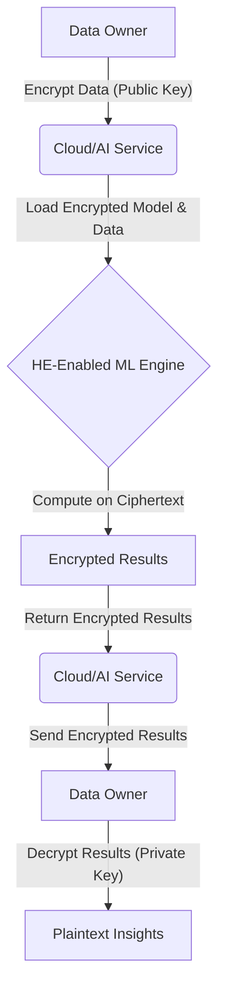

In an era defined by data, the promise of Artificial Intelligence often comes with a chilling caveat: the erosion of privacy. We're constantly reminded of data breaches, surveillance concerns, and the uneasy feeling that our most personal information is a commodity, freely traded and analyzed by algorithms we don't understand. The conventional wisdom has been: to leverage the power of AI, you must sacrifice your data's intimacy.

But what if that wasn't true? What if AI could operate on your sensitive data without ever needing to decrypt it? What if your financial records, medical history, or proprietary business strategies could be fed into powerful machine learning models, yielding insights that drive innovation, without a single byte of raw information ever being exposed?

Welcome to the future of privacy, powered by the incredible synergy of Machine Learning and Homomorphic Encryption (HE). This isn't just a technological advancement; it's a paradigm shift poised to redefine trust in the digital age, making your data truly invisible to prying eyes, even while it's being actively computed upon. If you think data privacy is a lost cause, prepare to have your mind blown.

## The Privacy Paradox: Why AI Needs a Shield

Artificial Intelligence thrives on data. The more data, the smarter the model, the more accurate the predictions. From personalized medicine and financial fraud detection to intelligent urban planning and targeted advertising, AI's potential is boundless. However, much of this high-value data – healthcare records, financial transactions, genetic information, intellectual property – is inherently sensitive.

Current approaches to privacy often fall short:

*   **Encryption at Rest/In Transit:** While crucial, this protects data only when it's stored or moving. Once data is brought into memory for computation, it must be decrypted, making it vulnerable.
*   **Anonymization/Pseudonymization:** Techniques like removing direct identifiers or replacing them with pseudonyms can be effective, but re-identification attacks are a persistent threat, especially with rich datasets.
*   **Differential Privacy:** Adds statistical noise to data or query results to obscure individual contributions. While robust, it can degrade data utility and model accuracy, especially with limited datasets.
*   **Federated Learning:** Allows models to be trained on decentralized datasets without directly sharing the raw data. However, model updates themselves can sometimes leak sensitive information, and it doesn't protect against malicious insiders within the federated network.

These methods offer varying degrees of protection, but none allow for the *direct computation on encrypted data* without ever exposing the plaintext. This is where Homomorphic Encryption steps in as the ultimate game-changer.

## Homomorphic Encryption: The Digital Glove Box for Your Data

Imagine you want to perform a complex calculation on a piece of paper, but you don't want anyone to see the numbers or the result. Instead of giving the paper to a mathematician, you put it into a special "glove box" that allows the mathematician to perform operations *inside* the box, without ever opening it. When the calculation is done, you get the box back, open it with your key, and see the final result.

That "glove box" is Homomorphic Encryption. At its core, HE is a form of encryption that allows computations to be performed on ciphertext (encrypted data), generating an encrypted result which, when decrypted, matches the result of operations performed on the plaintext.

There are different flavors of HE:

*   **Partially Homomorphic Encryption (PHE):** Supports only one type of operation (e.g., addition *or* multiplication) an unlimited number of times. RSA (multiplication) and Paillier (addition) are examples.
*   **Somewhat Homomorphic Encryption (SHE):** Supports a limited number of different operations (e.g., a few additions and multiplications).
*   **Fully Homomorphic Encryption (FHE):** The holy grail. Supports arbitrary computations on encrypted data, meaning you can perform any program or algorithm on ciphertext without decryption, an unlimited number of times. This was first achieved by Craig Gentry in 2009.

FHE schemes (like BFV, BGV, CKKS) are mathematically complex, relying on lattice-based cryptography. They allow for operations like addition and multiplication, which are the fundamental building blocks of almost all computer programs, including machine learning algorithms.

## The Fusion: How ML and HE Intersect for Unprecedented Privacy

Combining Machine Learning and Homomorphic Encryption opens up a new frontier for privacy-preserving AI. The typical workflow looks like this:

1.  **Data Owner Encrypts:** A user or organization encrypts their sensitive data using a public key provided by the AI service provider.
2.  **Cloud/AI Service Computes:** The encrypted data is sent to a cloud server or an AI service. Critically, the server *never* has access to the decryption key.
3.  **Encrypted Model Execution:** The AI model (either for training or inference) operates directly on this encrypted data. All calculations – additions, multiplications, comparisons – are performed on ciphertext.
4.  **Encrypted Results:** The server returns the encrypted results.
5.  **Data Owner Decrypts:** Only the original data owner, holding the private key, can decrypt the results to see the plaintext output.

This process ensures that at no point is the raw, sensitive data exposed to the cloud provider, malicious actors, or even the AI model developer.

### Use Cases: Where HE-Powered ML Shines

*   **Healthcare:** Training diagnostic models on encrypted patient data across multiple hospitals without ever pooling unencrypted records. Enabling personalized medicine without compromising patient confidentiality.
*   **Finance:** Detecting fraud, assessing credit risk, or performing anti-money laundering checks on encrypted transaction data. Banks can collaborate on threat intelligence without revealing customer details.
*   **Government & Defense:** Processing classified information with AI, ensuring that data remains encrypted even during active analysis.
*   **Cloud AI Services:** Offering AI-as-a-Service where clients can submit encrypted queries, and the cloud model returns encrypted predictions, guaranteeing data secrecy.
*   **Personalized Advertising:** Building highly effective advertising models based on user behavior without ever revealing individual identities or browsing history to advertisers.

### Architectural Vision: A Secure AI Pipeline

Imagine an AI pipeline where privacy is baked in from the ground up:



This conceptual architecture shows a clear separation of concerns: the data owner controls the keys and sees the plaintext, while the AI service handles the complex computations on opaque data.

### Code Snippet: A Glimpse into HE-Enabled ML

While full-scale FHE implementations are complex, libraries like Microsoft SEAL, IBM HElib, Google's TFHE, and TenSEAL (integrating SEAL with PyTorch) are making it more accessible. Here's a highly simplified, conceptual Python-like snippet demonstrating a basic encrypted linear regression prediction:

```python
# Conceptual Homomorphic Encryption Library (not actual working code)
class HEContext:
    def __init__(self, poly_modulus_degree=4096, coeff_modulus=[20, 20], scale=2**20):
        # Initialize HE parameters (simplified)
        print("Initializing HE context...")
        pass

    def generate_keys(self):
        # In reality, this generates a complex pair of keys
        print("Generating secret and public keys...")
        return "secret_key_obj", "public_key_obj"

    def encrypt(self, public_key, plaintext_value):
        print(f"Encrypting: {plaintext_value}")
        # Returns a ciphertext object
        return f"encrypted({plaintext_value})"

    def decrypt(self, secret_key, ciphertext_value):
        print(f"Decrypting: {ciphertext_value}")
        # Returns the plaintext value
        # In a real system, this involves complex polynomial operations
        return float(ciphertext_value.split('(')[1][:-1]) # Simple parsing for demo

    def add(self, ciphertext_a, ciphertext_b):
        print(f"Adding {ciphertext_a} and {ciphertext_b}")
        # Returns a new ciphertext representing the sum
        val_a = float(ciphertext_a.split('(')[1][:-1])
        val_b = float(ciphertext_b.split('(')[1][:-1])
        return f"encrypted({val_a + val_b})"

    def multiply(self, ciphertext_a, ciphertext_b):
        print(f"Multiplying {ciphertext_a} and {ciphertext_b}")
        # Returns a new ciphertext representing the product
        val_a = float(ciphertext_a.split('(')[1][:-1])
        val_b = float(ciphertext_b.split('(')[1][:-1])
        return f"encrypted({val_a * val_b})"

    def relinearize(self, ciphertext):
        print("Relinearizing ciphertext...")
        return ciphertext # Simplified for demo

    def rescale(self, ciphertext):
        print("Rescaling ciphertext...")
        return ciphertext # Simplified for demo


# --- Data Owner Side ---
he = HEContext()
secret_key, public_key = he.generate_keys()

# User's sensitive data point (e.g., income)
user_data = 75000.0

# Encrypt the user's data
encrypted_user_data = he.encrypt(public_key, user_data)

# --- AI Service Side (Receives encrypted_user_data and encrypted_model_weights) ---
# Pre-trained model weights (simplified for linear regression: y = m*x + b)
# In a real scenario, these weights would also be encrypted or generated securely
model_weight_m = 0.8
model_bias_b = 15000.0

# Encrypt model weights (if not already encrypted)
encrypted_m = he.encrypt(public_key, model_weight_m)
encrypted_b = he.encrypt(public_key, model_bias_b)

print("\n--- AI Service Performing Encrypted Prediction ---")
# Perform prediction: encrypted_prediction = encrypted_m * encrypted_user_data + encrypted_b
encrypted_product = he.multiply(encrypted_m, encrypted_user_data)
encrypted_product = he.relinearize(encrypted_product) # FHE specific operations
encrypted_product = he.rescale(encrypted_product)     # FHE specific operations

encrypted_prediction = he.add(encrypted_product, encrypted_b)
encrypted_prediction = he.rescale(encrypted_prediction) # FHE specific operations

print("Encrypted prediction computed.\n")

# --- Data Owner Side ---
# Decrypt the final prediction
final_prediction = he.decrypt(secret_key, encrypted_prediction)

print(f"Decrypted AI Prediction (e.g., estimated loan eligibility score): {final_prediction}")

# Compare with plaintext calculation (for verification)
plaintext_prediction = model_weight_m * user_data + model_bias_b
print(f"Plaintext Prediction (for comparison): {plaintext_prediction}")
```
This conceptual example highlights the core idea: operations (like multiplication and addition for a simple linear model) are performed on the `encrypted_` variables, and only the data owner can reveal the final `final_prediction`. Real-world FHE libraries involve complex polynomial arithmetic, noise management, and careful parameter selection to ensure security and correctness.

## The Road Ahead: Overcoming Challenges for Widespread Adoption

While the potential of HE is immense, significant challenges remain:

*   **Performance Overhead:** FHE operations are orders of magnitude slower and require more computational resources than plaintext operations. This is the biggest hurdle for widespread adoption, especially for complex deep learning models.
*   **Complexity:** Implementing HE-enabled applications requires deep cryptographic expertise. Libraries are improving, but ease of use is still a work in progress.
*   **Algorithm Compatibility:** Not all machine learning algorithms are easily 'homomorphized.' Linear models, logistic regression, and shallow neural networks are more amenable than highly non-linear or complex architectures. Approximate HE schemes (like CKKS) help with floating-point numbers but introduce precision loss.
*   **Key Management:** Securely managing encryption keys is paramount.

However, rapid advancements are being made:

*   **Hardware Acceleration:** Dedicated FHE accelerators (FPGAs, ASICs) are under development by companies like Inpher, Zama, and Intel, promising significant speedups.
*   **Scheme Improvements:** New FHE schemes and optimizations are continuously improving efficiency and reducing noise growth.
*   **Framework Integration:** Projects like TenSEAL are bridging the gap between HE libraries and popular ML frameworks like PyTorch, making it easier for ML engineers to experiment.
*   **Standardization:** Efforts are underway to standardize FHE practices and APIs.

## Conclusion: The Dawn of Truly Private AI

The convergence of Machine Learning and Homomorphic Encryption is not just a niche cryptographic endeavor; it's a foundational shift for the entire digital ecosystem. It promises to unlock the full potential of AI by removing the privacy barrier, fostering innovation in sensitive domains, and rebuilding trust in an increasingly data-driven world.

Imagine a future where you can confidently share your data with AI services, knowing with mathematical certainty that your information remains yours alone. This isn't a distant dream; it's the privacy revolution that HE is bringing to our doorstep. Businesses, governments, and individuals who embrace this technology will not only secure their data but also gain a profound competitive advantage in the age of intelligent, yet invisible, computation. The privacy apocalypse is over. The era of truly confidential AI has begun.