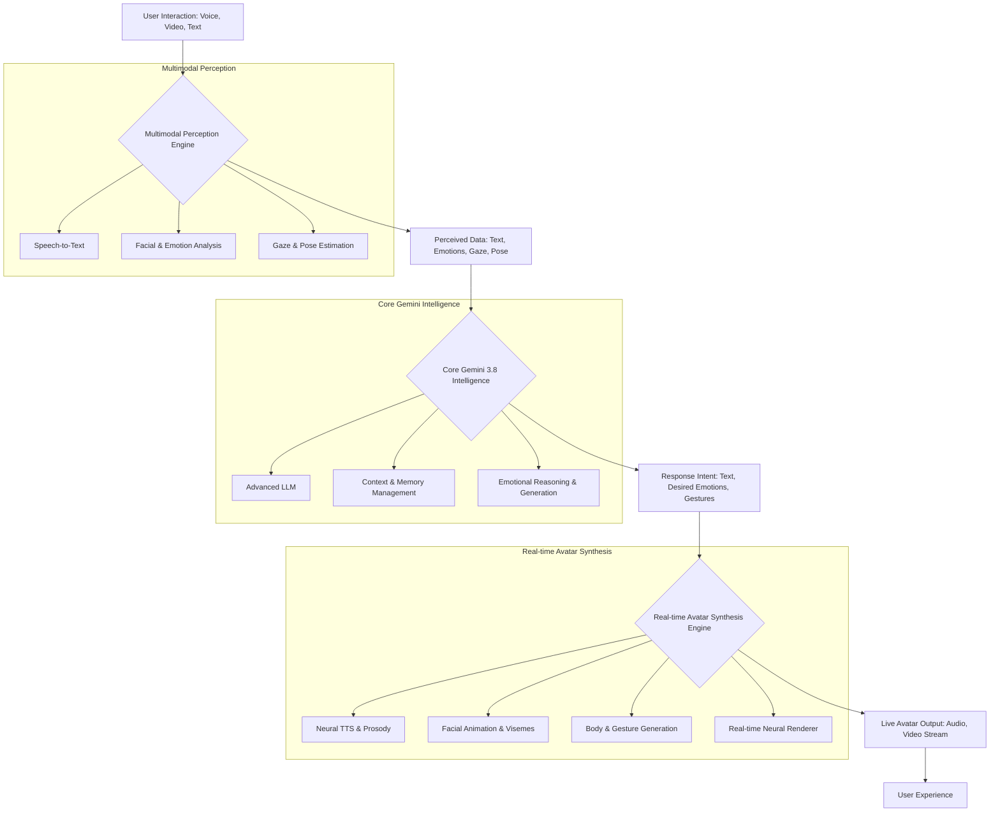

## Forget Chatbots: Gemini 3.8's Live Avatar Just Made AI *Human*

For years, our interactions with artificial intelligence have been largely confined to text boxes, disembodied voices, or rudimentary graphical interfaces. We've tapped, typed, and spoken into the void, often feeling the sterile distance inherent in digital communication. But what if the AI could look back? What if it could not only understand your words but also perceive your subtle frown, your hesitant glance, or the joy in your smile? What if it could respond not just with perfectly synthesized speech, but with a nuanced facial expression, a gentle nod, or a thoughtful tilt of its head?

Enter Gemini 3.8 with Live Avatar. This isn't just another incremental update; it's a seismic shift that redefines the very essence of human-AI interaction. Gone are the days of sterile commands and functional responses. We are on the precipice of an era where AI agents don't just process information; they embody presence. They see you, they hear you, and they respond with an emotional resonance that blurs the lines between silicon and sentience.

This blog post isn't just about marveling at the magic; it's a deep dive into the engineering marvels, the architectural complexities, and the profound implications of bringing a truly "live" avatar to life through the raw power of Gemini 3.8. Get ready to explore the tech that's about to make AI *human*.

### The "Live Avatar" Revolution: Beyond Static Pixels

What exactly makes Gemini 3.8's avatar "live"? It's more than just a rendered 3D model. A truly live avatar possesses several critical dimensions:

1.  **Real-time Responsiveness:** Near-zero latency between user input (speech, facial cues) and avatar output (speech, expressions, gestures).
2.  **Multimodal Perception:** The ability to understand not just language, but also visual and auditory non-verbal cues (emotions, gaze, tone, body language).
3.  **Emotional Intelligence & Expression:** The AI can infer user emotions and generate contextually appropriate emotional expressions on its avatar.
4.  **Photorealistic & Consistent Embodiment:** A highly detailed and believable visual representation that maintains consistency throughout the interaction.
5.  **Contextual Awareness:** A deep understanding of the ongoing conversation, user history, and environmental factors to inform responses and expressions.

Achieving this requires a symphony of advanced AI models, high-performance computing, and ingenious real-time rendering techniques.

### Architectural Blueprint: A Symphony of AI Subsystems

The backbone of Gemini 3.8 with Live Avatar is a sophisticated, highly integrated architecture designed for extreme low-latency and multimodal processing. Conceptually, it can be broken down into three primary pillars: Multimodal Perception, Core Gemini Intelligence, and Real-time Avatar Synthesis.



*(Note: While a full architectural diagram is complex, this conceptual flow illustrates the primary data pathways and components.)*

### Deep Dive into the Components: The Magic Under the Hood

#### 1. Multimodal Perception Engine

This is where the AI "sees" and "hears" you. It's a complex array of neural networks working in parallel to extract rich data from your live input.

*   **Speech-to-Text (STT) & Speaker Diarization:** Highly accurate, low-latency STT models (e.g., leveraging advanced Transformer transducers) convert spoken words into text. Speaker diarization identifies who is speaking in multi-person scenarios.
*   **Facial & Emotion Analysis:** Computer vision models trained on vast datasets of human expressions detect facial landmarks, analyze micro-expressions, and infer emotional states (e.g., joy, sadness, surprise, anger). This goes beyond simple sentiment analysis of text.
*   **Gaze & Pose Estimation:** Deep learning models track eye movements, head pose, and even subtle body language to understand attention, engagement, and non-verbal cues.

**Conceptual Code Snippet: Multimodal Perception**

```python
import cv2
import numpy as np
from transformers import pipeline # Illustrative for STT, Emotion

class MultimodalPerceptionEngine:
    def __init__(self):
        # Initialize specialized models for each modality
        self.stt_pipeline = pipeline("automatic-speech-recognition", model="openai/whisper-large-v3") # Example
        self.face_detector = cv2.CascadeClassifier(cv2.data.haarcascades + 'haarcascade_frontalface_default.xml') # Basic example
        self.emotion_predictor = pipeline("text-classification", model="bhadresh-savani/bert-base-uncased-emotion") # Example for text-based emotion

        # In a real system, these would be sophisticated real-time neural networks
        self.video_emotion_model = self._load_realtime_video_emotion_model()
        self.gaze_tracker = self._load_gaze_tracking_model()

    def _load_realtime_video_emotion_model(self):
        # Placeholder for a complex, custom-trained video emotion model
        # This would likely involve CNNs, LSTMs, or Transformers for temporal analysis
        print("Loading real-time video emotion model...")
        return lambda frame: {"neutral": 0.6, "happy": 0.3, "surprise": 0.1} # Mock output

    def _load_gaze_tracking_model(self):
        # Placeholder for a dedicated gaze tracking model
        print("Loading gaze tracking model...")
        return lambda frame: (0.5, 0.5) # Mock normalized gaze coordinates

    def process_live_input(self, audio_chunk: np.ndarray, video_frame: np.ndarray) -> dict:
        """Processes a single chunk of audio and video frame."""
        perceived_data = {}

        # 1. Speech-to-Text
        if audio_chunk.size > 0:
            # In a real system, this would be a streaming STT
            # For illustration, we'll simulate a chunk process
            # stt_result = self.stt_pipeline(audio_chunk.tobytes().decode('latin-1'), generate_kwargs={"task": "transcribe"})
            # For simplicity, let's mock text transcription
            perceived_data['text'] = "User is speaking about Gemini 3.8."
            perceived_data['text_confidence'] = 0.95

        # 2. Facial & Emotion Analysis (from video)
        if video_frame is not None:
            gray_frame = cv2.cvtColor(video_frame, cv2.COLOR_BGR2GRAY)
            faces = self.face_detector.detectMultiScale(gray_frame, 1.1, 4)

            if len(faces) > 0:
                x, y, w, h = faces[0] # Focus on the dominant face
                face_roi = video_frame[y:y+h, x:x+w]
                
                # Real-time video emotion model
                video_emotions = self.video_emotion_model(face_roi)
                perceived_data['facial_emotions'] = video_emotions
                
                # Gaze tracking
                perceived_data['gaze_direction'] = self.gaze_tracker(face_roi)
                perceived_data['head_pose'] = (x + w/2, y + h/2) # Mock head center

            # Fallback to text-based emotion if no face or video
            elif 'text' in perceived_data:
                text_emotions = self.emotion_predictor(perceived_data['text'])
                perceived_data['inferred_text_emotions'] = text_emotions[0]['label']
            else:
                perceived_data['facial_emotions'] = {"neutral": 1.0} # Default if no face detected

        return perceived_data

# Example usage (mock)
# engine = MultimodalPerceptionEngine()
# mock_audio = np.random.rand(16000).astype(np.float32) # 1 second of audio
# mock_video_frame = np.zeros((480, 640, 3), dtype=np.uint8) # A blank frame
# perceived_input = engine.process_live_input(mock_audio, mock_video_frame)
# print(perceived_input)
```

#### 2. Core Gemini 3.8 Intelligence

This is the brain of the operation, where the perceived data is processed, understood, and a coherent, empathetic response is formulated.

*   **Advanced Large Language Model (LLM):** Gemini 3.8 itself, with enhanced capabilities in reasoning, context management, and multimodal understanding. It can synthesize information from text, images, and now, real-time emotional and visual cues.
*   **Context & Memory Management:** Beyond the limited context windows of earlier LLMs, Gemini 3.8 employs sophisticated memory systems (e.g., external knowledge graphs, long-term memory modules) to maintain deep conversational history and user preferences over extended interactions.
*   **Emotional Reasoning & Generation:** This is where Gemini truly shines. It uses the perceived emotions to inform its understanding of the user's state and generates responses that are not just factually correct but also emotionally appropriate. It can infer *its own* desired emotional tone and non-verbal cues for the avatar.

**Conceptual Code Snippet: Core Gemini Intelligence**

```python
class GeminiCore:
    def __init__(self, model_version="3.8"):
        # Placeholder for actual Gemini 3.8 API/SDK interaction
        print(f"Loading Gemini {model_version} model...")
        self.llm_agent = self._initialize_gemini_api(model_version)
        self.context_manager = ConversationContextManager()

    def _initialize_gemini_api(self, version):
        # In a real scenario, this would be an API call or local model load
        class MockGeminiAPI:
            def generate_response(self, prompt, current_context, perceived_emotions):
                # Simulate advanced LLM reasoning and emotional generation
                print(f"Gemini processing: {prompt}")
                if "sad" in perceived_emotions.values():
                    return {"text": "I understand you might be feeling down. How can I help?", "emotion_intent": "empathetic", "gesture_hint": "slight_head_tilt"}
                elif "happy" in perceived_emotions.values():
                    return {"text": "That's wonderful to hear! Tell me more.", "emotion_intent": "joyful", "gesture_hint": "slight_smile"}
                else:
                    return {"text": "Thank you for sharing. What else is on your mind?", "emotion_intent": "neutral_curious", "gesture_hint": "open_hand"}
        return MockGeminiAPI()

    def formulate_response(self, perceived_data: dict) -> dict:
        """Formulates a response based on perceived input and conversation context."""
        current_context = self.context_manager.get_context()
        user_text = perceived_data.get('text', '')
        user_emotions = perceived_data.get('facial_emotions', perceived_data.get('inferred_text_emotions', {"neutral": 1.0}))

        prompt = (
            f"User says: '{user_text}'. "
            f"User's perceived emotions: {user_emotions}. "
            f"Current conversation context: {current_context}. "
            "Please generate an empathetic and relevant response, specifying desired emotional tone and an appropriate gesture."
        )

        gemini_output = self.llm_agent.generate_response(prompt, current_context, user_emotions)
        
        # Update context for future turns
        self.context_manager.add_turn(user_text, gemini_output['text'])
        
        return gemini_output

class ConversationContextManager:
    def __init__(self, max_turns=10):
        self.history = []
        self.max_turns = max_turns

    def add_turn(self, user_input, ai_response):
        self.history.append({"user": user_input, "ai": ai_response})
        if len(self.history) > self.max_turns:
            self.history.pop(0) # Keep context window manageable

    def get_context(self):
        return "\n".join([f"User: {turn['user']}\nAI: {turn['ai']}" for turn in self.history])

# Example usage (mock)
# gemini_brain = GeminiCore()
# mock_perceived_data = {'text': 'I had a really tough day.', 'facial_emotions': {'sad': 0.8, 'neutral': 0.2}}
# response_intent = gemini_brain.formulate_response(mock_perceived_data)
# print(response_intent)
```

#### 3. Real-time Avatar Synthesis Engine

This is where the AI's internal response is transformed into a visual and auditory experience. It's the most computationally intensive part, demanding extreme efficiency.

*   **Neural Text-to-Speech (TTS) with Prosody Control:** High-fidelity TTS models convert the AI's response text into natural-sounding speech, critically controlling prosody (intonation, rhythm, stress) to match the desired emotional intent.
*   **Viseme Generation & Lip-Sync:** For realistic speech, the avatar's mouth movements must precisely synchronize with the generated audio. Viseme models predict the visual mouth shapes for each phoneme.
*   **Facial Animation & Emotional Mapping:** The desired emotional tone and explicit "gesture hints" from Gemini 3.8 are mapped to a vast library of facial action units (FAUs) and blendshapes. These drive the avatar's expressions in real-time.
*   **Body & Gesture Generation:** Subtle body language (e.g., hand gestures, head nods, posture shifts) are generated by generative models, ensuring natural flow and congruence with the overall emotional state.
*   **Real-time Neural Renderer:** This is the visual powerhouse. Techniques like neural radiance fields (NeRFs) or advanced mesh-based rendering pipelines are employed to generate photorealistic avatar frames at high frame rates (e.g., 30-60 FPS) with extremely low latency. This often involves specialized hardware (GPUs, NPUs).

**Conceptual Code Snippet: Real-time Avatar Synthesis**

```python
class AvatarSynthesisEngine:
    def __init__(self):
        print("Initializing Real-time Neural Renderer, TTS, and Animator...")
        self.neural_renderer = self._load_neural_renderer()
        self.tts_model = self._load_neural_tts_with_prosody()
        self.facial_animator = self._load_facial_animator()
        self.body_animator = self._load_body_animator()

    def _load_neural_renderer(self):
        # Placeholder for a highly optimized real-time neural rendering pipeline
        # This would handle blending of facial expressions, visemes, and body motion
        class MockNeuralRenderer:
            def render_frame(self, audio_data, facial_data, body_data, visemes):
                # Simulate frame rendering based on inputs
                # In reality, this is where high-fidelity 3D models and textures are manipulated
                # and rendered at high frame rates.
                print(f"Rendering frame with audio_len={len(audio_data)}, facial={facial_data['expression']}, viseme={visemes[0] if visemes else ''}")
                return {"video_frame_bytes": b"mock_video_frame_data", "latency_ms": 15}
        return MockNeuralRenderer()

    def _load_neural_tts_with_prosody(self):
        # Placeholder for an advanced TTS model capable of emotional inflection
        class MockTTS:
            def generate_audio(self, text, emotion_intent):
                print(f"Generating audio for '{text}' with {emotion_intent} intent.")
                # Simulate audio waveform generation
                return np.random.rand(48000).astype(np.float32) # 1 sec of audio
            
            def generate_visemes(self, text):
                # Simulate viseme prediction for lip-sync
                return ['aa', 'bb', 'cc'] # Example visemes
        return MockTTS()

    def _load_facial_animator(self):
        # Placeholder for a model mapping emotional intents/FAUs to blendshapes
        class MockFacialAnimator:
            def map_intent_to_expressions(self, emotion_intent, gesture_hint):
                if emotion_intent == "empathetic":
                    return {"expression": "soft_smile", "brow_raise": 0.2}
                elif emotion_intent == "joyful":
                    return {"expression": "wide_smile", "eye_crinkle": 0.8}
                else:
                    return {"expression": "neutral", "head_nod": 0.1}
        return MockFacialAnimator()

    def _load_body_animator(self):
        # Placeholder for a model generating subtle body movements
        class MockBodyAnimator:
            def generate_body_pose(self, emotion_intent, gesture_hint):
                if gesture_hint == "slight_head_tilt":
                    return {"head_rotation": (0, 0, 5)} # Euler angles
                elif gesture_hint == "open_hand":
                    return {"hand_pose": "open"}
                else:
                    return {"posture": "relaxed"}
        return MockBodyAnimator()

    def synthesize_live_output(self, response_intent: dict) -> dict:
        """Synthesizes audio and video for the live avatar."""
        text = response_intent['text']
        emotion_intent = response_intent['emotion_intent']
        gesture_hint = response_intent.get('gesture_hint', '')

        # 1. Generate Audio and Visemes
        audio_waveform = self.tts_model.generate_audio(text, emotion_intent)
        visemes = self.tts_model.generate_visemes(text)

        # 2. Generate Facial Expressions and Body Language
        facial_data = self.facial_animator.map_intent_to_expressions(emotion_intent, gesture_hint)
        body_data = self.body_animator.generate_body_pose(emotion_intent, gesture_hint)

        # 3. Render Avatar Frame
        avatar_output = self.neural_renderer.render_frame(
            audio_data=audio_waveform,
            facial_data=facial_data,
            body_data=body_data,
            visemes=visemes
        )
        
        avatar_output['audio_waveform'] = audio_waveform # Include audio for playback
        return avatar_output

# Example usage (mock)
# avatar_engine = AvatarSynthesisEngine()
# mock_response_intent = {'text': 'I understand you might be feeling down. How can I help?', 'emotion_intent': 'empathetic', 'gesture_hint': 'slight_head_tilt'}
# live_output = avatar_engine.synthesize_live_output(mock_response_intent)
# print(live_output)
```

### Engineering Challenges and Breakthroughs

Bringing Gemini 3.8 with Live Avatar to fruition isn't just about combining existing technologies; it demands significant innovation:

*   **Ultra-Low Latency:** The primary challenge is end-to-end latency. Every millisecond counts to make the interaction feel natural. This requires highly optimized models, parallel processing